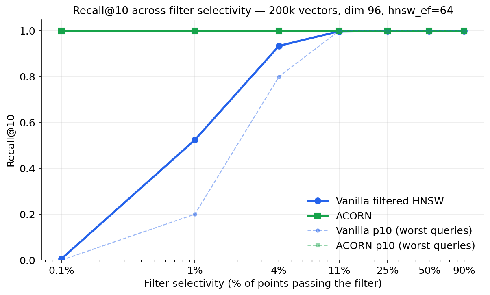
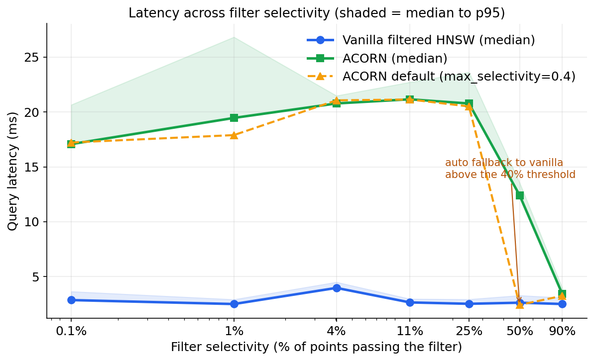

# ACORN vs Vanilla Filtered HNSW (Qdrant 1.16)

Benchmark code comparing ACORN vs vanilla filtered HNSW in Qdrant.

It measures recall@10 and latency for vanilla filtered HNSW vs the ACORN search
algorithm (new in Qdrant 1.16) across filter selectivity levels from 0.1% to 90%.

## What's in here

| File | What it does |
| --- | --- |
| `bench_acorn.py` | builds the collection, runs the full selectivity sweep and the `hnsw_ef` sweep, saves `results.json` |
| `make_charts.py` | turns `results.json` into the three charts used in the post |
| `results.json` | the raw numbers from my run (Qdrant 1.16.3, 1 vCPU) |

## Setup

```bash
# run Qdrant 1.16+
docker run -p 6333:6333 qdrant/qdrant:v1.16.3

pip install qdrant-client numpy matplotlib

python bench_acorn.py    # takes a few minutes, HNSW build is the slow part
python make_charts.py
```

## Benchmark design (short version)

- 200,000 vectors, dim 96, cosine, clustered data (mixture of 1,024 Gaussians)
- combined two-field filters to hit exact selectivity levels: two independent
  fields with V values each give 1/V² combined selectivity (V=10 -> 1%, V=32 -> ~0.1%)
- `full_scan_threshold` is set very low on purpose, to remove the query planner's
  brute-force safety net and show the raw graph behavior
- ground truth from `exact=True` with the same filter, recall@10, 50 queries per level
- three modes per level: vanilla, ACORN forced on (`max_selectivity=1.0`),
  and ACORN with the default threshold (`max_selectivity=0.4`)

## Headline result

| Selectivity | Vanilla recall@10 | ACORN recall@10 |
| --- | --- | --- |
| 0.1% | 0.006 | 1.000 |
| 1% | 0.524 | 1.000 |
| 4% | 0.934 | 1.000 |
| 11%+ | ~1.000 | 1.000 |



ACORN costs roughly 7-8x latency in the danger zone (2.5 ms -> ~20 ms on this
machine), and with the default threshold it deactivates automatically above 40%
selectivity, falling back to vanilla speed.



## References

- Paper: [ACORN: Performant and Predicate-Agnostic Search Over Vector Embeddings and Structured Data](https://arxiv.org/abs/2403.04871)
- [Qdrant 1.16 release blog](https://qdrant.tech/blog/qdrant-1.16.x/)
- [ACORN in the Qdrant docs](https://qdrant.tech/documentation/search/search/#acorn-search-algorithm)
