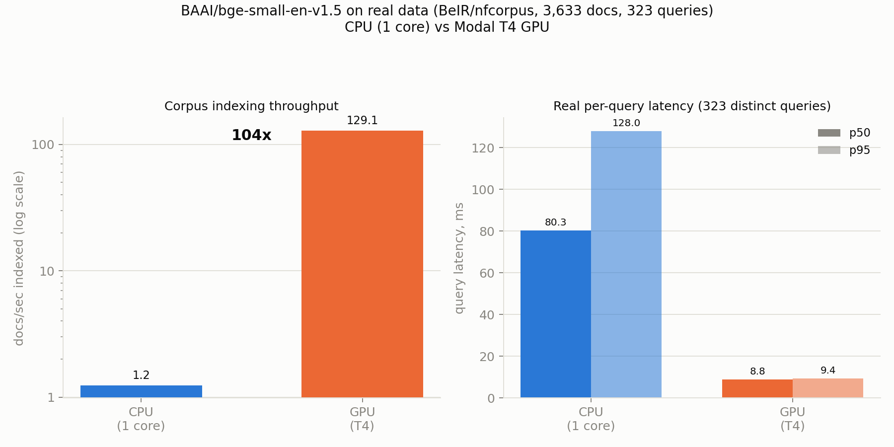
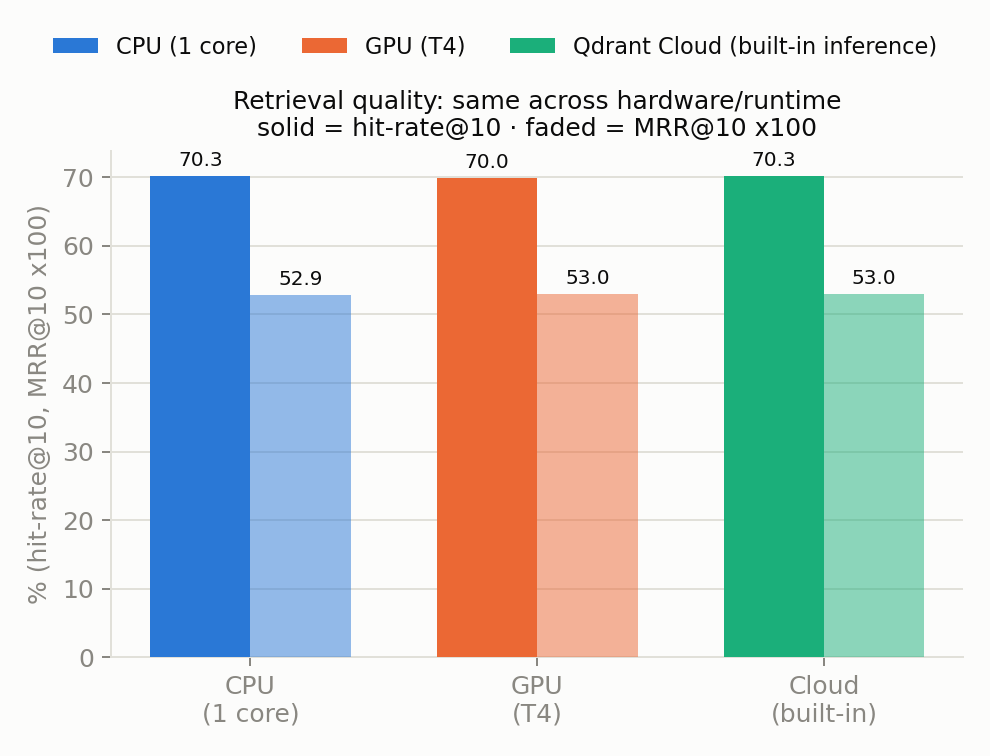

# Running Embedding Models Alongside Qdrant - No External API Calls

A guide (with runnable examples) for generating embeddings **inside your own
deployment** instead of round-tripping every document and query through a
third-party embedding API. Covers `fastembed`, local model-serving sidecars,
and Qdrant's built-in inference, plus the tradeoffs between them.

## The problem

The default RAG wiring looks like this:

```
your app --> embedding API (OpenAI / Cohere / ...) --> Qdrant
```

Every upsert and every query pays for a network hop to a provider outside
your cluster, on top of per-token billing. That hop adds:

- **Latency** - an extra external round trip on the hot path of every search
  request, on top of whatever the provider's own queueing looks like.
- **Cost** - a per-token bill that scales with traffic, separate from your
  Qdrant bill.
- **A hard dependency** - provider rate limits, outages, and API changes
  become your outages.
- **Data exposure** - raw text (which may include user queries or private
  documents) leaves your network boundary on every request.

None of this is necessary for the majority of retrieval workloads, where a
small, well-chosen embedding model run locally gets you 90% of the quality
at a fraction of the latency and cost.

## Measured, not hand-waved

`benchmark_real_data.py` runs the actual pipeline end to end against
[BeIR/nfcorpus](https://huggingface.co/datasets/BeIR/nfcorpus), a public
Hugging Face dataset of 3,633 real PubMed abstracts (123-10,090 chars, mean
~1,591) and 323 real test queries with human relevance judgments - no
synthetic or repeated text. Model: `BAAI/bge-small-en-v1.5`, on a single
shared CPU core, no Docker, no external network calls beyond the one-time
model and dataset download.

| Metric | CPU (1 core) | Modal T4 GPU | Qdrant Cloud built-in inference |
|---|---|---|---|
| Corpus indexing throughput (3,633 real docs) | 1.24 docs/sec | 129.1 docs/sec (**104x**) | ~1.5 docs/sec* |
| Real query latency (323 distinct queries), p50 / p95 | 80.3 ms / 128.0 ms | 8.8 ms / 9.4 ms | 46.4 ms / 55.1 ms |
| Retrieval quality: hit-rate@10 / MRR@10 | 70.3% / 0.529 | 70.0% / 0.530 | 70.3% / 0.530 |

\* Pattern C's indexing number is not directly comparable to the other two -
the run got interrupted and resumed several times (see
`benchmark_qdrant_cloud_inference.py`'s resumability notes), so
`corpus_index_docs_per_sec` only times the final segment, not one clean
end-to-end pass. Treat it as "same order of magnitude as local CPU," not a
precise figure - the query latency and retrieval-quality numbers are clean.




**The headline finding**: document length dominates embedding throughput far
more than batch size. A transformer's per-document cost scales with sequence
length (up to the model's truncation limit - 512 tokens for
`bge-small-en-v1.5`), and batching only amortizes *fixed per-call* overhead,
not *per-token* compute - so a corpus of realistic paragraph-length
abstracts indexes far slower than a short-sentence toy benchmark would
suggest. If you're sizing an ingestion pipeline for real documents,
benchmark with real document lengths, not short synthetic text. In practice
this is also the argument for **chunking** long documents into shorter
passages before embedding, which is standard RAG practice anyway for
retrieval precision, and recovers most of that throughput.

Retrieval quality (70.3% hit-rate@10 - the fraction of queries with at
least one known-relevant document in the top 10; MRR@10 0.529) is measured
directly against NFCorpus's own human relevance judgments, not borrowed from
a published leaderboard. NFCorpus is a deliberately hard biomedical
retrieval task, so treat this as one real data point for `bge-small` on
*this* task, not a general quality claim about the model.

Raw numbers are specific to this sandboxed single-core run - re-benchmark
on your own hardware, traffic shape, and document lengths before sizing
anything - but the qualitative points transfer: every one of these numbers
came from a single process with no external round trip in the critical
path, and document length matters far more than batch size. See
`benchmark_real_data.py` / `results_real_data.json` for the full run.

A GPU counterpart (`gpu_benchmark_modal.py`, same corpus, same model, on a
Modal T4 via `sentence-transformers`/CUDA rather than FastEmbed's ONNX
runtime - see that file's docstring for why) confirms the CPU numbers above
are compute-bound, not an artifact of the single-core sandbox: **104x**
indexing throughput and roughly **9-14x** lower query latency on GPU. See
`results_real_data_gpu.json` for the raw run.

A third run (`benchmark_qdrant_cloud_inference.py` / `cloud_inference_benchmark_modal.py`)
measures Pattern C - Qdrant Cloud's built-in inference - the same corpus,
model, and queries, but embedded *server-side*: the client sends raw text,
Qdrant Cloud embeds it in the same cluster the data lives in, no third-party
API in the loop at all. Two results stand out:

- **It beat the local single-core CPU run on latency** - 46.4 ms p50 vs.
  80.3 ms - despite the extra network hop, because Qdrant Cloud's
  server-side hardware isn't sitting on one shared core. For a team that
  would otherwise be running FastEmbed on a modest app-server core, Cloud
  inference is the faster *and* lower-ops option: nothing to provision,
  scale, or keep warm.
- **Retrieval quality is identical to within noise** across all three
  patterns (same weights, same architecture - runtime/hardware doesn't
  change what the model outputs), so picking Cloud inference costs you
  nothing on correctness.

The one place it doesn't win is against a dedicated GPU (8.8 ms p50) - if
you've already provisioned GPU-backed serving, Pattern B or a
`fastembed-gpu` setup will beat Cloud inference on raw latency. But that's
a comparison against *having a GPU to manage*, not against doing nothing:
against the realistic alternative of a CPU-bound app server, Qdrant Cloud's
built-in inference is the pattern with the least infrastructure **and** the
better number. See `results_qdrant_cloud_inference.json` for the raw run.

## The alternative: embed next to (or inside) Qdrant

There are three deployment patterns, in increasing order of infrastructure:

### Pattern A - In-process embedding with FastEmbed

[FastEmbed](https://github.com/qdrant/fastembed) is Qdrant's own lightweight
embedding library. It runs on ONNX Runtime, is CPU-only by default (no GPU
required), and ships quantized versions of common models (e.g.
`BAAI/bge-small-en-v1.5`, `sentence-transformers/all-MiniLM-L6-v2`,
`Qdrant/bm25` and `prithivida/Splade_PP_en_v1` for sparse vectors, late
interaction models like `colbert-ir/colbertv2.0`).

Because it's just a Python library, it loads into the same process as your
application - there's no second network hop for embedding at all, only the
call to Qdrant itself. This is the simplest pattern: no extra containers, no
extra service to operate.

`qdrant-client` bakes this in directly: pass a `models.Document` (raw text
plus a model name) as a point's vector, and the client embeds it locally
with FastEmbed before it ever reaches Qdrant - no separate embedding call:

```python
from qdrant_client import QdrantClient, models

client = QdrantClient(url="http://localhost:6333")  # or your cluster URL

client.create_collection(
    collection_name="docs",
    vectors_config=models.VectorParams(
        size=client.get_embedding_size("BAAI/bge-small-en-v1.5"),
        distance=models.Distance.COSINE,
    ),
)

client.upsert(
    collection_name="docs",
    points=[
        models.PointStruct(
            id=1,
            vector=models.Document(text="Qdrant is a vector database.", model="BAAI/bge-small-en-v1.5"),
            payload={"source": "readme"},
        ),
    ],
)

response = client.query_points(
    collection_name="docs",
    query=models.Document(
        text="How do I avoid calling an external embedding API?",
        model="BAAI/bge-small-en-v1.5",
    ),
)
```

No API key, no external host, nothing to configure beyond picking a model.
See [`ingest_and_query.py`](ingest_and_query.py) for a complete, tested,
runnable version - verified against `qdrant-client==1.19.0` /
`fastembed==0.8.0`.

Best for: serverless functions, low-to-moderate traffic services, anywhere
you'd rather not run and scale a separate embedding service.

### Pattern B - A local model-serving sidecar

For larger or custom models (a fine-tuned encoder, a bigger multilingual
model, or something GPU-bound) it often makes more sense to run a dedicated
embedding server as a **sidecar** - a container that lives next to Qdrant
(or your app) on the same pod, VM, or ECS task, reachable only over the
loopback interface or an internal-only network.

Common choices:

- [Text Embeddings Inference (TEI)](https://github.com/huggingface/text-embeddings-inference)
- [Infinity](https://github.com/michaelfeil/infinity)
- A FastEmbed model wrapped behind your own small FastAPI service, if you
  want one shared instance behind several app replicas.

Because the embedding server never has a public listener, and the two
containers talk over `localhost`/an internal docker network, there's no
egress at all involved in generating a vector - see
[`docker-compose.yml`](docker-compose.yml) for a self-contained example that
runs Qdrant and TEI side by side with no external calls.

Best for: bigger models, multiple services sharing one embedding server, or
GPU-backed serving where you want to scale the embedder independently from
Qdrant itself.

### Pattern C - Qdrant Cloud's built-in inference

Qdrant Cloud can host FastEmbed-compatible models directly alongside your
managed cluster. Instead of embedding client-side, you send raw text as a
`Document` inside your upsert/query payload, and the cluster embeds it
server-side, in the same region as the data - no separate embedding
infrastructure, and still no third-party API anywhere in the request path.

This is the pattern with the **least infrastructure of all three**, and in
our benchmark it wasn't a tradeoff against speed either: it beat the local
single-core CPU run on query latency (46.4 ms vs. 80.3 ms p50 - see
"Measured, not hand-waved" above), because Qdrant Cloud's server-side
hardware outruns one shared app-server core even with the network hop
included. If the realistic alternative is FastEmbed on a modest CPU
instance rather than a provisioned GPU, Cloud inference is both less to
operate and faster.

```python
from qdrant_client import QdrantClient, models

client = QdrantClient(url="https://<cluster>.cloud.qdrant.io", api_key="...")

client.upsert(
    collection_name="docs",
    points=[
        models.PointStruct(
            id=1,
            vector=models.Document(text="Qdrant is a vector database.", model="BAAI/bge-small-en-v1.5"),
            payload={"source": "readme"},
        )
    ],
)
```

This removes the embedding step from your application entirely - there's no
sidecar to run and no separate library to keep in sync with your collection's
vector configuration. The one real limitation is model choice: you're
restricted to whatever Qdrant Cloud hosts, vs. FastEmbed's full model list
locally. Check the current model list and region availability in the
[Qdrant Cloud documentation](https://qdrant.tech/documentation/cloud/inference/)
before committing to it, since both change over time.

## Choosing a pattern

| | Infra to run | Scales independently | Model flexibility | p50 query latency (our benchmark) | Good default for |
|---|---|---|---|---|---|
| A: FastEmbed in-process | None | No (scales with your app) | Any FastEmbed-supported model | 80.3 ms (1 shared CPU core) | Most RAG services, serverless, low/medium traffic |
| B: Sidecar (TEI/Infinity) | One extra container | Yes | Anything the server supports, incl. GPU models | 8.8 ms (with a GPU behind it) | Shared embedding load, custom/fine-tuned/large models |
| C: Qdrant Cloud inference | None | Managed by Qdrant Cloud | Limited to hosted models | 46.4 ms | Teams that want zero embedding infra *and* better latency than a CPU-bound app server |

All three share the same property: the text never leaves your own
network boundary (patterns A and B) or leaves it only to your own Qdrant
Cloud cluster (pattern C) - never to an unrelated third-party API.

## Practical notes

- **Model size vs. quality**: small CPU models (roughly 30M–130M
  parameters, e.g. `all-MiniLM-L6-v2` or `bge-small`) are a good starting
  point for most retrieval tasks and keep cold-start/load time low. Reach
  for a bigger model or a GPU sidecar only once you've measured that
  retrieval quality actually needs it.
- **Cold starts**: model weights need to load before the first request can
  be embedded. For pattern A, keep a minimum warm instance count if you're
  on serverless; for pattern B, the sidecar loads once and stays warm
  independently of your app's own scaling.
- **Shared model cache**: mount a persistent volume for the FastEmbed/TEI
  model cache directory so replicas don't each re-download the same weights
  on every restart or deploy.
- **Keep dimensions in sync**: whichever pattern you use, the vector size
  and distance metric on your Qdrant collection must match the model you
  embed with - changing embedding models means re-indexing, not just
  swapping a config value.
- **Benchmark for your own traffic**: the latency and cost savings here are
  directional - an external API call is strictly more network hops and adds
  metered per-token cost, but the actual numbers depend heavily on your
  model size, hardware, and request volume, so measure your own workload
  rather than relying on someone else's numbers.

## Files in this folder

- `ingest_and_query.py` - Pattern A: FastEmbed via `qdrant-client`'s
  built-in `Document`-based local inference, no API key required, runs
  entirely locally. Verified against `qdrant-client==1.19.0` /
  `fastembed==0.8.0`.
- `docker-compose.yml` - Pattern B: Qdrant + a TEI sidecar on an internal
  Docker network, demonstrating no-external-call local model serving.
- `benchmark_real_data.py` - the real-data benchmark against
  [BeIR/nfcorpus](https://huggingface.co/datasets/BeIR/nfcorpus) (3,633 real
  abstracts, 323 real queries): indexing throughput, real per-query
  latency, and retrieval quality (hit-rate@10, MRR@10) against human
  relevance judgments. Requires the extra `datasets` dependency.
- `results_real_data.json` - raw output of the last `benchmark_real_data.py`
  run.
- `gpu_benchmark_modal.py` - GPU counterpart of the same real-data
  benchmark, run detached on a Modal T4. See the file for how to launch and
  fetch results.
- `results_real_data_gpu.json` - raw output of the last `gpu_benchmark_modal.py`
  run.
- `cloud_inference_lib.py` - the actual Pattern C benchmark logic
  (resumable indexing, retries, retrieval quality), shared by the two
  runners below so a fix only has to happen in one place.
- `benchmark_qdrant_cloud_inference.py` - runs the Pattern C benchmark
  against a live Qdrant Cloud cluster's built-in inference, locally.
  Resumable: safe to rerun after any crash, it picks up from the cluster's
  current point count instead of re-embedding from scratch. Requires
  `QDRANT_URL` / `QDRANT_API_KEY` env vars for a cluster with inference
  enabled.
- `cloud_inference_benchmark_modal.py` - same Pattern C benchmark, run
  detached from a Modal container instead of your local machine - useful if
  your local network can't reliably hold a ~15-20 minute run open. See the
  file's docstring for the methodology tradeoff this introduces.
- `results_qdrant_cloud_inference.json` - raw output of the last Pattern C
  run.
- `requirements.txt` - Python dependencies for `ingest_and_query.py`.
  `benchmark_real_data.py` additionally needs `pip install datasets`,
  `gpu_benchmark_modal.py` and `cloud_inference_benchmark_modal.py` need
  `pip install modal`, and `benchmark_qdrant_cloud_inference.py` needs
  `pip install datasets qdrant-client fastembed`.
