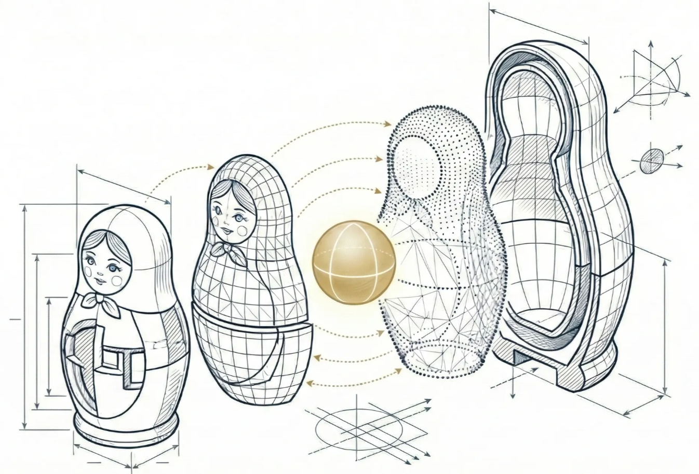

# Matryoshka: One Vector to Serve Them All

**[Read the full article here](https://mohamedarbi.xyz/posts/matryoshka)**

## 🪆 Matryoshka Representation Learning (MRL)

Matryoshka Representation Learning (MRL) is a training strategy that encodes information at multiple granularities within a single high-dimensional vector. Inspired by Russian nesting dolls, MRL allows a single embedding vector to be sliced at various lengths (e.g., 64, 128, 256, 512, 1024 dimensions) while still maintaining semantic meaning and performance.

### The Core Concept

Traditional embedding models force a trade-off: large vectors for accuracy or small vectors for efficiency. MRL solves this by training the model such that the early dimensions contain the most critical information, and subsequent dimensions add finer details.

-   **Slicing is all you need**: You don't need multiple models. One MRL-trained model produces a large flexible vector that can be truncated to suit downstream tasks with varying resource constraints.
-   **Not just an optimization**: Unlike pruning or quantization, MRL preserves the full embedding capability while enabling adaptive usage during inference and retrieval.

### Key Benefits

1.  **Adaptive Retrieval**:
    -   **Shortlisting (Pass 1)**: Use a small slice (e.g., 64d) to quickly filter millions of documents. This can result in up to **128x speedups**.
    -   **Reranking (Pass 2)**: Use the full vector (e.g., 2048d) only on the top candidates for maximum accuracy.
2.  **Efficiency**: Achieves comparable accuracy to standard baselines but with significantly smaller embedding sizes (up to 14x smaller).
3.  **Flexibility**: One model serves both high-powered servers and resource-constrained edge devices.

## MRL with Qdrant and Gemini

Qdrant supports Matryoshka embeddings, allowing for efficient multi-step retrieval pipelines. This is now natively supported with Google's latest embedding models.

### Resources

-   **Official Qdrant Blog**: [Qdrant + Gemini Embedding 2 Support](https://qdrant.tech/blog/qdrant-gemini-embedding-2/)
-   **Implementation Guide**: [Multimodal Semantic Search with Gemini 2 + Qdrant](https://mohamedarbi.xyz/posts/gemini2qdrant)
