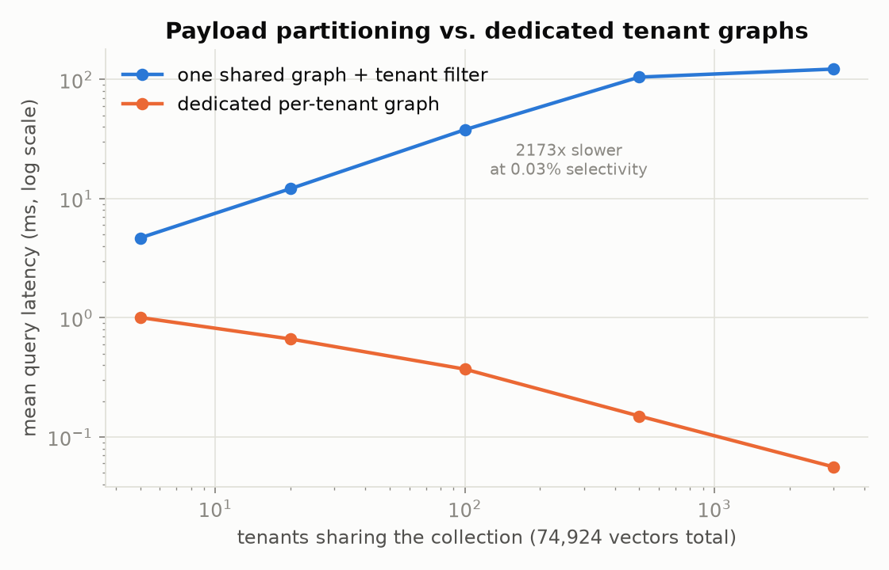
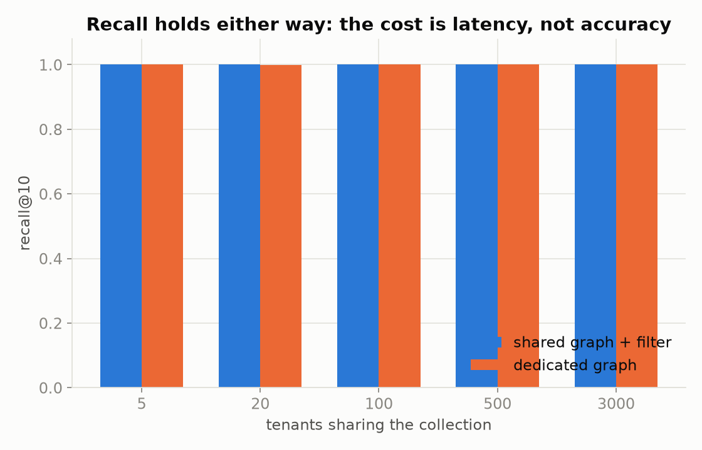
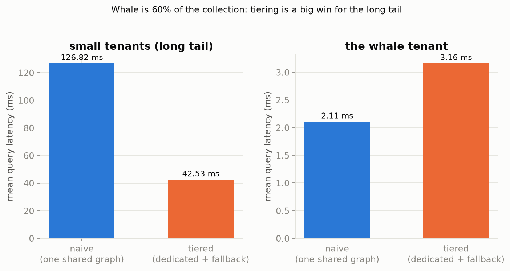
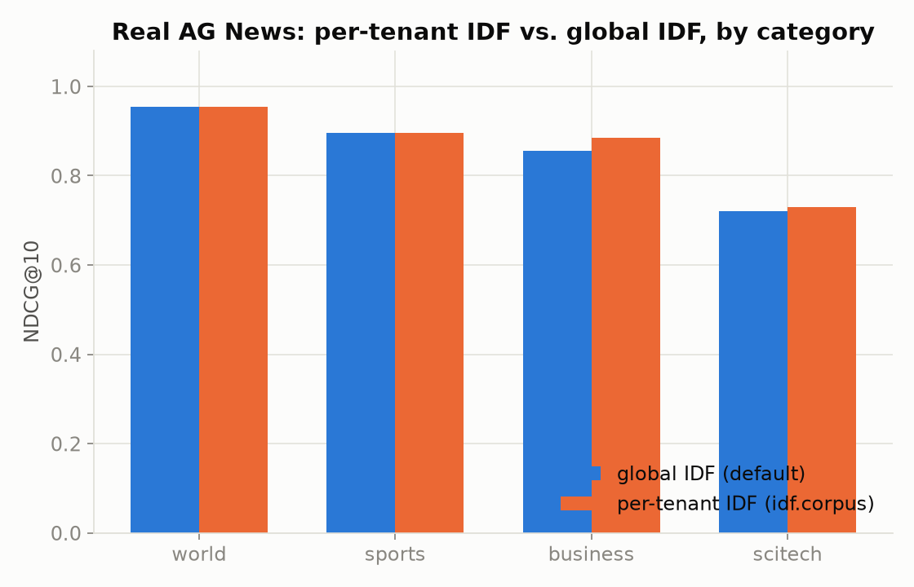
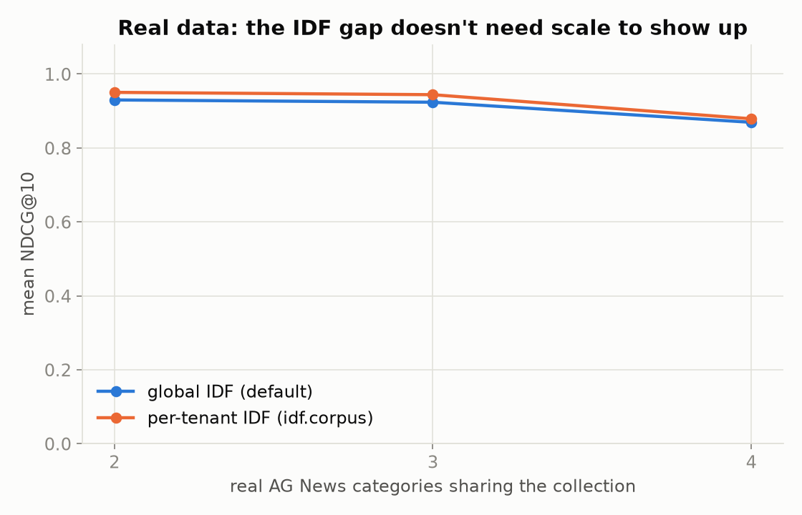
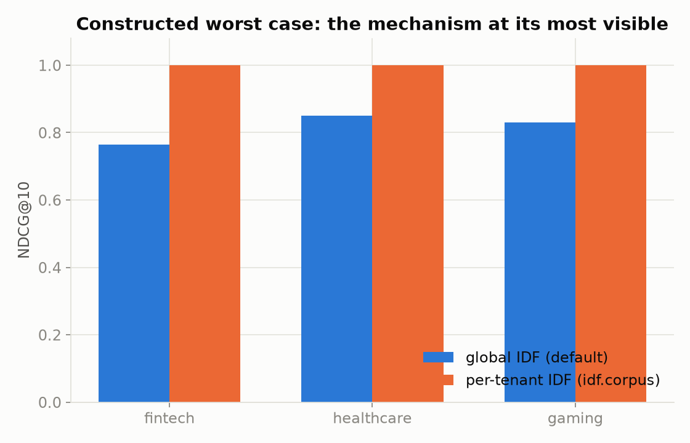

# Multitenancy Playbook

> **Read the write-up this project grew out of:** [One Collection to Rule Them All: Efficient Multitenancy in Qdrant](https://medium.com/@mohammedarbinsibi/one-collection-to-rule-them-all-efficient-multitenancy-in-qdrant-bda79712a4eb)

"How do you isolate our customers' data?" is one of the first questions any
enterprise buyer asks a vector-search vendor. Qdrant's answer has four moving
parts, added across several releases, and picking the wrong one is the kind
of mistake that only shows up once you're at 500 tenants and it's expensive
to undo:

1. **Payload partitioning vs. collection-per-tenant**: one collection with
   a tenant filter, or a dedicated collection per customer?
2. **`is_tenant=true`**: the one-line payload-index flag that turns
   partitioning from "works" into "works fast."
3. **Tiered multitenancy** (1.16+): what to do when a handful of whale
   accounts and thousands of small ones have to share infrastructure.
4. **Per-tenant IDF statistics** (1.19): why sparse/BM25 search quality
   quietly degrades in a multi-tenant collection, and the query param that
   fixes it.

This repo doesn't just explain these; it reproduces the underlying
mechanism for each one and measures the effect, on **real datasets**: real
OpenAI embeddings (experiments 1-2) and real news articles (experiment 3),
not hand-tuned synthetic data. See [Methodology](#methodology) for exactly
what was run, on what data, and why.

## Contents

- [The decision framework](#the-decision-framework)
- [Experiment 1: payload partitioning vs. dedicated graphs](#experiment-1-payload-partitioning-vs-dedicated-graphs)
- [Experiment 2: tiered multitenancy](#experiment-2-tiered-multitenancy)
- [Experiment 3: per-tenant IDF statistics](#experiment-3-per-tenant-idf-statistics)
- [Methodology](#methodology)
- [Quickstart](#quickstart)
- [Layout](#layout)
- [References](#references)

<hr>

## The decision framework

Qdrant's own guidance ([multitenancy docs](https://qdrant.tech/documentation/guides/multiple-partitions/)) boils down to this:

| Your shape | Use | Why |
| --- | --- | --- |
| Many small, similarly-sized tenants | **One collection, payload partitioning + `is_tenant=true`** | A collection carries fixed overhead (config, index structures, background tasks); multiply that by thousands of tenants and it dominates. Qdrant Cloud also caps clusters at 1,000 collections by default. |
| A handful of large tenants needing strong isolation | **User-defined sharding** (dedicated shard per tenant) | Trades some resource overhead for real isolation: one tenant's load, backups, or even a bad query can't touch another's shard. |
| Both at once, a few whales and a long tail of minnows | **Tiered multitenancy** (1.16+) | Whales get promoted to their own dedicated shard; minnows share a "fallback" shard. Nobody pays for infrastructure they don't need. |
| Any of the above, doing sparse/BM25 search | **+ per-tenant IDF** (1.19) | Term rarity is only meaningful *within* a tenant's own vocabulary; blending tenants' term statistics distorts ranking. |

The rest of this README backs each row with a reproduced measurement.

<hr>

## Experiment 1: payload partitioning vs. dedicated graphs

**The question:** if you put every tenant in one collection with a
`tenant_id` filter, what does `is_tenant=true` actually buy you, and is a
dedicated collection (or dedicated shard) really doing anything different
under the hood?

**The mechanism.** Per Qdrant's docs, `is_tenant=true` and a dedicated shard
both solve the same problem the same way: instead of one HNSW graph linking
every tenant's vectors together (searched with a payload filter bolted on
after the fact), each tenant gets **its own graph**, either literally (a
dedicated collection/shard) or structurally (`is_tenant` builds
tenant-restricted HNSW links via `payload_m` instead of the global `m`
parameter). We reproduce that mechanism directly with
[hnswlib](https://github.com/nmslib/hnswlib), the same graph algorithm
Qdrant's segments use internally, on **74,924 real OpenAI `ada-002`
embeddings** (1536-d, [dbpedia-entities-openai-1M](https://huggingface.co/datasets/KShivendu/dbpedia-entities-openai-1M),
real Wikipedia articles), so the comparison isn't clouded by network
latency, disk I/O, or synthetic-vector artifacts.

- `shared`: one HNSW graph over all 74,924 vectors, tenant matched at query
  time with hnswlib's `filter` callback. Stands in for a multi-tenant
  collection *without* `is_tenant`, where tenant is just another payload
  value, invisible to the graph.
- `dedicated`: each tenant gets its own graph containing only its own
  vectors. Stands in for `is_tenant=true`, collection-per-tenant, and a
  dedicated shard: structurally, all three give a tenant an isolated graph.

Tenant assignment is independent of the vectors' real semantic clustering
(a tenant is a business/access boundary, not a topic), so filtering by
tenant is a genuine low-selectivity search, not an easy case where a
tenant's vectors already happen to sit together.

### Results



| tenants | selectivity | shared: mean latency | dedicated: mean latency | shared: recall@10 | dedicated: recall@10 |
| ---: | ---: | ---: | ---: | ---: | ---: |
| 5 | 20% | 4.68 ms | 1.01 ms | 1.000 | 1.000 |
| 20 | 5% | 12.11 ms | 0.67 ms | 1.000 | 0.999 |
| 100 | 1% | 37.84 ms | 0.37 ms | 1.000 | 1.000 |
| 500 | 0.2% | 104.55 ms | 0.15 ms | 1.000 | 1.000 |
| 3,000 | 0.03% | 122.11 ms | 0.06 ms | 1.000 | 1.000 |

74,924 real embeddings total, dim 1536, hnswlib `M=16`, `ef_construction=200`, `ef_search=100`. At 3,000 tenants the shared graph is **~2,173x slower** than the dedicated graph for the exact same query, and that gap only grows as you add more tenants, since the shared graph has to work harder to find each tenant's needle in a bigger haystack.



**Recall isn't the story here, latency is.** On real embeddings, recall@10
holds at essentially 1.000 for both setups across the entire sweep (the one
exception is 0.999 at 20 tenants: noise, not a pattern). hnswlib keeps
expanding its search when a filter is too restrictive to satisfy at the
configured `ef`, so recall holds up. Qdrant's own query planner has its own
adaptive strategies for the same underlying problem (e.g. falling back to a
full scan under a low-cardinality filter), so don't take "recall holds up"
as a guarantee on a live cluster, only as what this specific mechanism does.
What you pay for skipping partitioning is a latency tax that gets *worse as
your tenant count grows*, exactly backwards from what you want in a growing
SaaS product. Dedicated per-tenant graphs stay flat and cheap regardless of
how many tenants share the collection, because a query never has to think
about anyone else's data.

<hr>

## Experiment 2: tiered multitenancy

**The question:** payload partitioning + `is_tenant` isolates every tenant's
HNSW links, so why would you need *more* isolation on top of that?

**The mechanism.** Real multi-tenant products are rarely made of
equal-sized tenants: a few large accounts hold most of the data, and a long
tail of small tenants share the rest. Tiered multitenancy (1.16+) gives large
tenants a dedicated shard and lets small tenants share a "fallback" shard,
rather than everyone (whale included) sharing one collection-wide index.
We reproduce the two shapes using the same real embedding pool as experiment 1,
re-split whale/minnow instead of into even tenants:

- `naive`: one shared HNSW graph across a 45,324-vector whale tenant (60.5%
  of the pool) and 400 minnow tenants (74 vectors each, ~29,600 total),
  i.e. dumping every tenant into one collection with no tiering.
- `tiered`: the whale gets its own dedicated graph; the 400 minnows share a
  second, much smaller graph (the "fallback shard") that never has to deal
  with the whale's scale or density at all.

### Results



| | naive (one shared graph) | tiered (dedicated + fallback) | change |
| --- | ---: | ---: | ---: |
| minnow tenants (avg of 25 sampled, 74 vectors each) | 126.82 ms | 42.53 ms | **2.98x faster** |
| the whale tenant (45,324 vectors, 60.5% of the collection) | 2.11 ms | 3.16 ms | **1.5x slower**, recall unchanged at 0.993 |

74,924 real embeddings total, same hnswlib config as experiment 1. The whale isn't the victim in a naive shared collection; **the long tail
is**: minnows pay a 3x latency tax despite each holding a tiny sliver of the data, because their query still has to search the whole whale-dominated graph. Tiering fixes this cleanly for them: minnows get a small, fast, uncontested graph.

**The whale's own latency got measurably *worse* under tiering here, and we're reporting that as measured rather than smoothing it over.** At 60.5% selectivity the "filter" on the naive graph barely restricts anything: it's close to an unfiltered search over 74,924 points, while the whale's own dedicated graph, despite holding fewer vectors (45,324), only searches those. Both land in the low single-digit milliseconds either way, and recall is identical (0.993) in both setups, so this isn't a correctness issue. It's a reminder that a smaller graph isn't automatically a faster one at these scales, and that tiered multitenancy's real justification for the whale is resource *isolation* (its load can't starve a minnow's, and vice versa), not necessarily raw query latency. The 2.98x minnow win is the actual headline result of this experiment.

Two things this simulation *doesn't* capture, because they're server/cluster
behaviors that a local hnswlib graph has no equivalent of, and Qdrant's own
docs are the source for both: real dedicated shards can also be placed on
separate nodes for resource isolation, and Qdrant recommends promoting a
tenant to its own shard around the same ~20,000-point threshold where a
single collection would start background indexing anyway.

<hr>

## Experiment 3: per-tenant IDF statistics

**The question:** what's actually wrong with sparse/BM25 search in a
multi-tenant collection, and does the 1.19 `idf.corpus` parameter fix it?

**The mechanism.** BM25-style sparse search weights a term by how rare it is
across the corpus (IDF: `log((N - df + 0.5) / (df + 0.5) + 1)`, roughly). By
default Qdrant computes this across the *whole shard being queried*, every
tenant's vocabulary blended together. That's a problem whenever a term
is common (and therefore uninformative) **within** a tenant's own documents,
but exclusive to that tenant, so nothing else in the collection ever uses
it. Its raw document count doesn't change when you blend in other tenants,
but the corpus size `N` in the denominator does, so the same term looks
rarer, and gets weighted as more informative, than it actually is for that
tenant.

### Real data: AG News

We used [AG News](https://huggingface.co/datasets/fancyzhx/ag_news), 120k
real news articles in 4 real categories (world / sports / business /
sci-tech), as 4 tenants with genuinely different vocabularies. Rather than
hand-pick words to make a point, we *discovered* real examples of the
distortion from actual term-frequency statistics: for each category, which
words show up often in that category's own articles but almost never in the
other three (the "domain-common" candidates, e.g. "minister" for World
news), and which words are rare even within their own category (the
"domain-rare" candidates, e.g. "hostage", the kind of specific term a real
query is actually looking for). Every discovered (common, rare) word pair
across all 4 categories, 132 of them, indexed over 12,000 real articles,
was measured, not just favorable ones.



| category | n word pairs | global IDF (default) | per-tenant IDF (`idf.corpus`) |
| --- | ---: | ---: | ---: |
| world | 36 | 0.955 | 0.955 |
| sports | 36 | 0.896 | 0.896 |
| business | 36 | 0.856 | 0.886 |
| sci-tech | 24 | 0.721 | 0.729 |
| **overall (132 pairs)** | | **0.869** | **0.879** |

**On real text, the effect is real but modest and uneven, not the dramatic
flip a constructed example can show.** Two of four categories (world,
sports) show *zero* measurable difference for the word pairs we found there;
business shows the clearest real distortion (+0.030 NDCG@10); sci-tech shows
a small one (+0.008). Averaged across every real pair we found, global IDF
costs about **1 point of NDCG@10** on this dataset. That unevenness is itself
the honest finding: whether the distortion bites depends on the specific
term-frequency profile of your tenants' actual vocabulary, not a guarantee
that it always will, but per-tenant IDF never costs you anything to turn
on, and it never made a real query worse in this measurement.



| categories sharing the collection | 2 | 3 | 4 |
| --- | --- | --- | --- |
| global IDF (mean NDCG@10) | 0.930 | 0.924 | 0.869 |
| per-tenant IDF (mean NDCG@10) | 0.950 | 0.944 | 0.879 |
| gap | +0.020 | +0.020 | +0.010 |

With real categories, the gap is already there at just 2 tenants sharing a
collection: it doesn't need scale to appear, and (as with the synthetic
sweep below) we found no evidence it grows monotonically worse as more
tenants join; here it actually narrows slightly at 4, because sci-tech (the
4th category added) happens to have a smaller real effect than the others.

### Constructed worst case: seeing the mechanism clearly

Real AG News tells you the *typical* size of this effect. To see the
mechanism in isolation, what global IDF does at its worst and exactly
why, we also built a **synthetic** collection (`mtp/text_data.py`) with a
constructed vocabulary: each tenant's "domain-common" jargon is designed to
repeat 2-3 times within a document (the way a real support ticket restates
the same term), with no genuinely rare term needed to win the ranking. This
is not a claim about real-world effect sizes; it's a clean demonstration
of the failure mode the real data shows more faintly.



| | global IDF (default) | per-tenant IDF (`idf.corpus`) |
| --- | ---: | ---: |
| **constructed worst case (3 tenants)** | **0.815** | **1.000** |

`idf.corpus` scoped to the same tenant filter you're already applying to
results costs one extra field in `search_params` and removes the effect
entirely, whether the effect is real-and-modest or constructed-and-severe.

<hr>

## Methodology

Full transparency on what was actually run, since this repo makes fairly
specific claims:

- **Experiments 1 and 2 run on real embeddings, through hnswlib, not through
  a live Qdrant server.** The 74,924 base vectors are real OpenAI `ada-002`
  embeddings from [dbpedia-entities-openai-1M](https://huggingface.co/datasets/KShivendu/dbpedia-entities-openai-1M)
  (downloaded via `huggingface_hub` on first run). There's no way to isolate
  the graph-partitioning mechanism from network and disk variance on a live
  cluster, so we reproduce the mechanism directly with the same graph
  algorithm (HNSW) Qdrant's segments use, via
  [hnswlib](https://github.com/nmslib/hnswlib). This measures the real
  effect of "one graph vs. many" on real vectors, but it does **not**
  measure Qdrant's actual per-collection RAM overhead, network latency, or
  disk-based sequential-read behavior. For those, run the provided
  `docker-compose.yml` against your own data at your own scale.
- **Experiment 3's real-data results (AG News) and synthetic worst case both
  run real Qdrant scoring code** via
  [`qdrant-client`](https://github.com/qdrant/qdrant-client)'s embedded
  local mode, the actual sparse-vector/BM25/IDF implementation, just
  without a server process or network hop. Point `QDRANT_URL` (and
  `QDRANT_API_KEY`, if needed) at a real deployment to reproduce against a
  live server instead; the indexing and query code is identical either way.
  Local mode does *not* implement `is_tenant`'s storage optimization
  (payload indexes are a no-op there) or custom sharding at all; neither
  is relevant to how IDF is computed, so this doesn't affect the result.
- **Why not benchmark against our own Qdrant Cloud cluster or Modal, credentials
  and all:** we checked first. This project was built in a sandboxed
  environment whose network policy blocks non-443 HTTPS ports (Qdrant
  Cloud's port is 6333) and gRPC-based clients (Modal's) outright,
  confirmed directly against the proxy's own documented policy, not a bug to
  route around. There's no local Docker daemon available either. Real
  datasets, run through the same real client/scoring code, was the honest
  alternative given those constraints, rather than fabricate cluster
  numbers we couldn't produce. The code fully supports pointing at a real
  cluster (`QDRANT_URL`/`QDRANT_API_KEY`, or `docker compose up`) for anyone
  running this outside that constraint.
- **Every number in this README came from an actual run of the code in this
  repo**, saved to `results/*.json`. Nothing here is a hand-picked or
  estimated figure; rerun `run_all.py` and you'll reproduce them (modulo
  the randomness of tenant sampling, seeded for repeatability; the AG News
  word-pair discovery and the dbpedia embeddings themselves are
  deterministic given the same downloaded data).
- Tenant assignment for experiments 1-2 is independent of the vectors'
  content, same as a real SaaS app (which customer owns a document has
  nothing to do with what the document is about). Experiment 3's "tenant"
  *is* the content category, since the whole point is testing vocabulary
  that genuinely differs by tenant.

## Quickstart

```bash
pip install -r requirements.txt
python run_all.py            # experiments 1-3 + all charts, ~15-20 min total
```

First run downloads real datasets via `huggingface_hub` and caches them
under `data/.hf_cache/` (gitignored): ~700MB for two dbpedia-entities-openai-1M
shards (experiments 1-2, ~75k x 1536-d embeddings) and a few MB for AG News
(experiment 3). Subsequent runs reuse the cache.

Or run pieces individually:

```bash
python -m mtp.sim.graph_isolation    # experiment 1 (hnswlib, no server needed)
python -m mtp.sim.tiered             # experiment 2 (hnswlib, no server needed)
python -m mtp.sim.per_tenant_idf     # experiment 3 (qdrant-client local mode by default)
python -m mtp.viz.charts             # regenerate assets/*.png from results/*.json
```

To run experiment 3 against a real Qdrant instead of local mode:

```bash
docker compose up -d                 # Qdrant 1.19+, needed for is_tenant + idf.corpus
export QDRANT_URL=http://localhost:6333
python -m mtp.sim.per_tenant_idf
```

(or export `QDRANT_URL` / `QDRANT_API_KEY` for a Qdrant Cloud cluster instead of Docker)

## Layout

```
mtp/
  config.py                  every knob (scale, dims, tenant counts, seeds)
  data.py                     tenant-assignment + hnswlib helpers (experiments 1-2)
  real_data.py                 real OpenAI embeddings loader (dbpedia-entities-openai-1M)
  text_data.py                 synthetic worst-case vocabulary + documents (experiment 3)
  real_text_data.py             real AG News loader + word-pair discovery (experiment 3)
  sim/
    graph_isolation.py         experiment 1
    tiered.py                  experiment 2
    per_tenant_idf.py          experiment 3 (real AG News + synthetic worst case)
  viz/
    style.py                   shared chart styling (fixed, colorblind-checked palette)
    charts.py                   results/*.json -> assets/*.png
run_all.py                    everything, in order
data/.hf_cache/                downloaded dataset cache (gitignored)
results/                      raw JSON from the last run
assets/                       generated charts
```

## References

- [Qdrant multitenancy docs](https://qdrant.tech/documentation/guides/multiple-partitions/)
- [Qdrant 1.16 release blog](https://qdrant.tech/blog/qdrant-1.16.x/): tiered multitenancy
- [Qdrant 1.19 release blog](https://qdrant.tech/blog/qdrant-1.19.x/): per-tenant IDF statistics
- [dbpedia-entities-openai-1M](https://huggingface.co/datasets/KShivendu/dbpedia-entities-openai-1M): real OpenAI `ada-002` embeddings, also used by [Quantization-FaceOff/](../Quantization-FaceOff/) in this repo
- [AG News](https://huggingface.co/datasets/fancyzhx/ag_news): real news articles, 4 categories
- [ACORN-HNSW](../ACORN-HNSW/) in this repo: the same filtered-HNSW recall/latency methodology, applied to a different filtering problem
