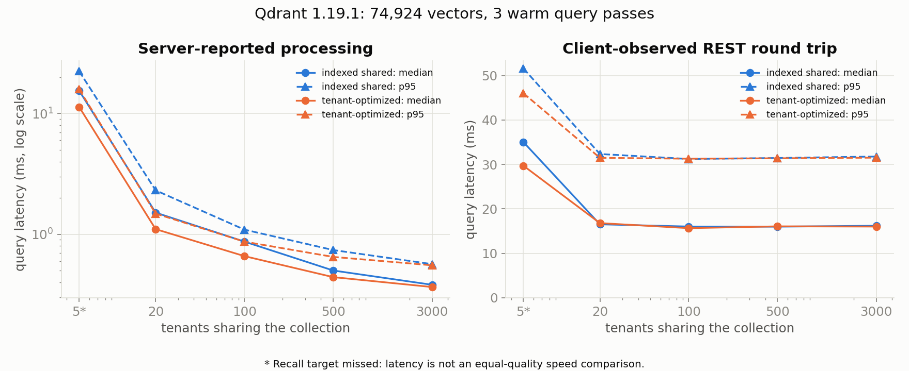
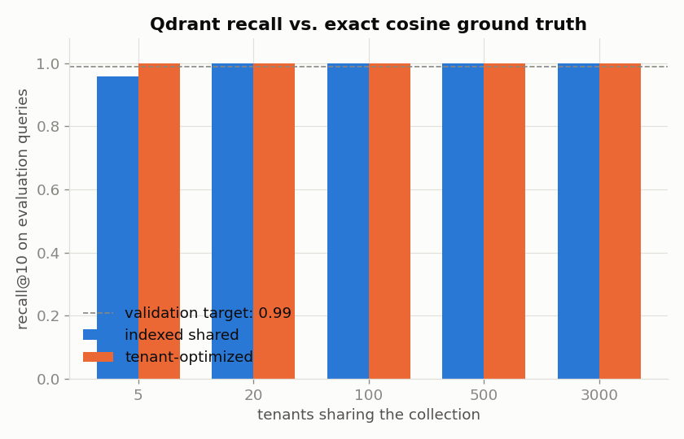
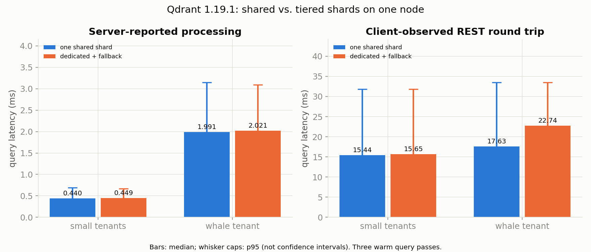
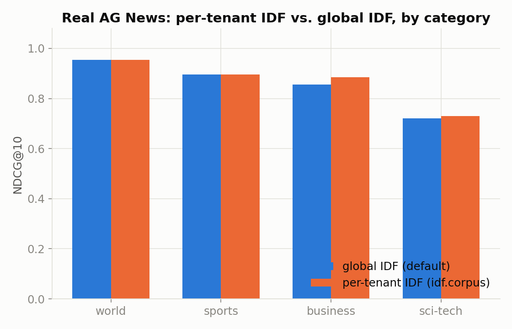
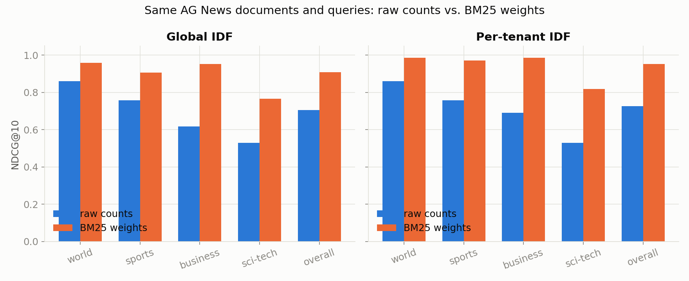
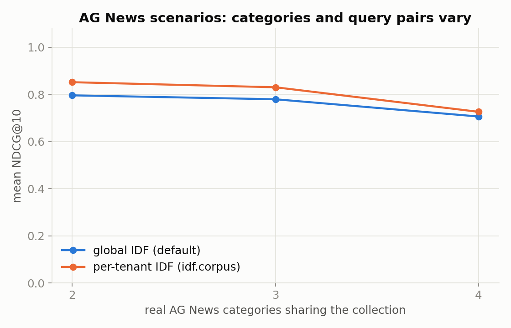
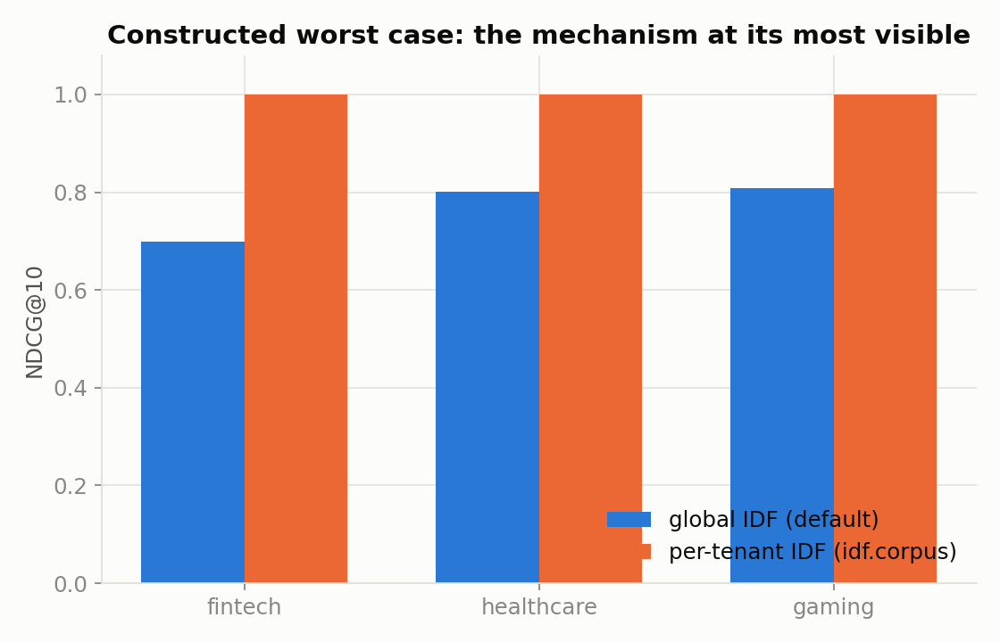

# Multitenancy Playbook

> **Read the write-up this project grew out of:** [One Collection to Rule Them All: Efficient Multitenancy in Qdrant](https://medium.com/@mohammedarbinsibi/one-collection-to-rule-them-all-efficient-multitenancy-in-qdrant-bda79712a4eb)

"How do you isolate our customers' data?" is one of the first questions any
enterprise buyer asks a vector-search vendor. Qdrant's answer has four moving
parts, added across several releases, and picking the wrong one is the kind
of mistake that only shows up once you're at 500 tenants and it's expensive
to undo:

1. **Payload partitioning vs. collection-per-tenant**: one collection with
   a tenant filter, or a dedicated collection per customer?
2. **`is_tenant=true`**: a payload-index flag that co-locates tenant data
   in storage to improve read locality.
3. **Tiered multitenancy** (1.16+): what to do when a handful of whale
   accounts and thousands of small ones have to share infrastructure.
4. **Per-tenant IDF statistics** (1.19): why sparse/BM25 search quality
   quietly degrades in a multi-tenant collection, and the query param that
   fixes it.

This repo measures Qdrant tenant-search configurations with **real OpenAI
embeddings** (experiments 1-2), compares shared and tiered Qdrant shard
layouts (experiment 2), and tests scoped IDF with **real news articles** plus a
constructed synthetic corpus (experiment 3). These controlled experiments
do not benchmark every Qdrant feature above. See [Methodology](#methodology) for exactly
what was run, on what data, and why.

## Contents

- [The decision framework](#the-decision-framework)
- [Experiment 1: Qdrant shared vs. tenant-optimized search](#experiment-1-qdrant-shared-vs-tenant-optimized-search)
- [Experiment 2: tiered multitenancy](#experiment-2-tiered-multitenancy)
- [Experiment 3: per-tenant IDF statistics](#experiment-3-per-tenant-idf-statistics)
- [Methodology](#methodology)
- [Quickstart](#quickstart)
- [Layout](#layout)
- [References](#references)

<hr>

## The decision framework

Qdrant's own guidance ([multitenancy docs](https://qdrant.tech/documentation/guides/multiple-partitions/)) boils down to this:

| Your shape | Use | Why |
| --- | --- | --- |
| Many small, similarly-sized tenants | **One collection, payload partitioning + `is_tenant=true`** | A collection carries fixed overhead (config, index structures, background tasks); multiply that by thousands of tenants and it dominates. Qdrant Cloud also caps clusters at 1,000 collections by default. |
| A handful of large tenants needing strong isolation | **User-defined sharding** (dedicated shard per tenant) | Separates tenant data and permits independent shard placement. Shards on the same node can still compete for CPU, memory, and I/O. |
| Both at once, a few whales and a long tail of minnows | **Tiered multitenancy** (1.16+) | Whales get promoted to their own dedicated shard; minnows share a "fallback" shard. Placement and capacity still need to match the workload. |
| Any of the above, doing sparse/BM25 search | **+ per-tenant IDF** (1.19) | Scopes term statistics to the intended corpus when shard-wide statistics do not represent the tenant. Validate relevance and latency for your workload. |

The experiments below illustrate selected mechanisms and state their limits.

<hr>

## Experiment 1: Qdrant shared vs. tenant-optimized search

**The question:** on an actual Qdrant server, how does indexed shared search
compare with the tenant-optimized configuration recommended in the
[Qdrant multitenancy guide](https://qdrant.tech/documentation/manage-data/multitenancy/)?

Both configurations use **one collection**, a keyword index on `tenant`,
identical cosine vectors and queries, and native tenant filters:

| Configuration | Global HNSW `m` | Payload HNSW `payload_m` | `is_tenant` |
| --- | ---: | ---: | --- |
| Indexed shared | 16 | 16 | false |
| Tenant-optimized | 0 | 16 | true |

The baseline retains Qdrant's native payload-aware graph links and query
planner. The optimized configuration removes the global graph and enables
tenant storage co-location. This compares two complete configurations;
it does not isolate the effect of `is_tenant` alone or simulate dedicated
collections/shards. Small filtered populations may use native exact scans
in either configuration; the benchmark does not force HNSW traversal.

### Dataset and measurement

- **74,924 real OpenAI `ada-002` embeddings**, 1536 dimensions, from
  [dbpedia-entities-openai-1M](https://huggingface.co/datasets/KShivendu/dbpedia-entities-openai-1M),
  with 2,000 separate held-out embeddings available as queries.
- Random content-independent tenant assignments, seed 42, at 5, 20, 100,
  500, and 3,000 tenants. Total vector count is fixed, so more tenants means
  fewer points per tenant. Both configurations receive exactly the same
  points, tenant assignments, and query vectors at each sweep point.
- Up to 25 sampled tenants, 20 evaluation queries per tenant. Five additional
  held-out queries per sampled tenant select a common `hnsw_ef` from
  100/200/400/800/1600/3200/6400 for a **0.99 mean validation recall target**. Validation
  queries are excluded from reported timings. Recall uses offline exact
  cosine top-10 restricted to the queried tenant, cross-checked against
  Qdrant exact search on the validation queries. If no tested setting meets
  the target for both layouts, the highest tested value is timed and the
  target failure is retained explicitly. A failed validation or evaluation
  target is marked with `*` in the latency chart; it is not an equal-quality
  speed comparison.
- Payload indexes are created before upload. Vector indexing is enabled
  after ingestion; measurement waits for green status and indexed-vector
  counts consistent with only small below-threshold appendable segments.
  Both configurations use `ef_construct=200`, one shard, a target of two
  segments, four indexing threads, and one optimization thread.
  `indexing_threshold=1000` and `full_scan_threshold=10000` are in KB.
- One full unmeasured warm-up pass, then **three measured passes**. Query
  order and which configuration runs first are randomized in each pass.
  Only one query is in flight. The index is built once per configuration
  per tenant count, not rebuilt between passes.
- **Client latency** measures the synchronous REST call, including client
  serialization, HTTP transport, and response parsing. **Server time** is
  Qdrant's reported processing time in the same response. Request-object
  construction and exact-ground-truth computation are outside the timer.
  The charts show pooled median and p95 across the three measured passes;
  per-pass summaries and individual measurements are saved in JSON.

### Results

**Server-reported processing time (ms):**

| Tenants | `hnsw_ef` | Shared median / p95 | Tenant-optimized median / p95 | Shared recall@10 | Tenant recall@10 |
| ---: | ---: | ---: | ---: | ---: | ---: |
| 5* | 6400 | 15.485 / 22.450 | 11.353 / 15.886 | 95.900% | 100.000% |
| 20 | 100 | 1.511 / 2.311 | 1.102 / 1.483 | 99.925% | 99.950% |
| 100 | 100 | 0.869 / 1.092 | 0.659 / 0.868 | 100.000% | 100.000% |
| 500 | 100 | 0.501 / 0.740 | 0.441 / 0.649 | 100.000% | 100.000% |
| 3,000 | 100 | 0.381 / 0.565 | 0.365 / 0.553 | 100.000% | 100.000% |

\* At five tenants, shared search missed the 99% recall target even at the
highest tested `hnsw_ef=6400`: validation recall was 98%, and evaluation
recall was 95.9%. Tenant-optimized search reached 100% on both. This point
is retained as a quality failure, not an equal-quality speed comparison.
The other four cases selected `hnsw_ef=100` and met the recall target.

**Client-observed REST round trip (ms):**

| Tenants | Shared median / p95 | Tenant-optimized median / p95 |
| ---: | ---: | ---: |
| 5* | 35.04 / 51.61 | 29.72 / 46.03 |
| 20 | 16.54 / 32.36 | 16.81 / 31.50 |
| 100 | 16.04 / 31.24 | 15.67 / 31.31 |
| 500 | 16.01 / 31.46 | 16.08 / 31.40 |
| 3,000 | 16.21 / 31.79 | 16.03 / 31.54 |





**What changed versus the simulation:** native Qdrant filtering makes the
shared baseline much more competitive. At 20 tenants, server median time
was 1.511 ms shared versus 1.102 ms tenant-optimized; at 100 tenants it was
0.869 versus 0.659 ms. The gap narrows further for smaller tenant populations.
Both layouts can benefit from Qdrant's planner-selected exact scans, so this
is not a pure graph-traversal comparison.

Client medians at 20-3,000 tenants stayed around 16 ms, with no consistent
winner across tenant counts. The gap between server and client timings shows
how much client/transport overhead matters in this setup. Tenant optimization
helped server processing here, but these results do not support the earlier
simulation's dramatic end-to-end speedup claim.

These are warm, serial measurements on Qdrant **v1.19.1** in Docker Desktop
on Windows, using an Intel Core i5-11400H (6 cores / 12 threads) and 16 GB host
RAM. Docker reports 12 CPUs and about 5.79 GiB of memory. The Python client
runs on Windows and reaches the server through Docker's localhost port
forwarding. This is a shared development laptop, not dedicated benchmark
hardware; client round-trip overhead and run-to-run variation matter.
These results do not measure cold-cache I/O, concurrent tenant isolation,
Cloud latency, or production throughput.

The new evidence is in
[`exp1_qdrant_graph_isolation.json`](results/exp1_qdrant_graph_isolation.json),
including effective server configs, index readiness, corpus/tenant-assignment
fingerprints, recall, and individual timings. The earlier hnswlib illustration
is retained in [`exp1_graph_isolation.json`](results/exp1_graph_isolation.json)
and `mtp/sim/graph_isolation.py` for historical comparison. Its previously
reported ~2,173x ratio is **not a measured Qdrant speedup** and is no longer
the experiment 1 headline or chart source.

<hr>

## Experiment 2: tiered multitenancy

**The question:** on actual Qdrant, does placing a large tenant in a dedicated
shard improve search for that tenant or the smaller tenants in the fallback shard?

Both layouts use one collection with custom sharding, native tenant filters,
`is_tenant=true`, `m=0`, and `payload_m=16`. The same 74,924 real embeddings
are assigned to one whale (45,324 points, 60.5%) and 400 small tenants
(74 points each, 29,600 total). Assignment is independent of vector content.

| Layout | Shared/fallback shard | Dedicated whale shard |
| --- | ---: | ---: |
| Shared | All 74,924 points | None |
| Tiered | 29,600 small-tenant points | 45,324 whale points |

This follows [Qdrant's native tiered routing](https://qdrant.tech/documentation/manage-data/multitenancy/#tiered-multitenancy):
requests use `ShardKeyWithFallback(target=tenant_id, fallback="fallback")`
and a matching tenant filter in **both** layouts. In the shared layout every
tenant routes to fallback; in the tiered layout tenant `"0"` has its own shard.
Exact counts verify all 401 tenant routes and confirm no whale points remain
in the tiered fallback shard before measurement.

### Dataset and measurement

- Qdrant **v1.19.1**, one Docker node with cluster mode enabled for custom
  shards. Replication factor is 1; no additional node or hardware is added.
- Identical graph and optimizer settings in both layouts: cosine vectors,
  `ef_construct=200`, four indexing threads, one optimization thread,
  `indexing_threshold=1000 KB`, and `full_scan_threshold=10000 KB`.
  A target of two segments **per shard** produces two indexed segments for
  shared and four for tiered in this run. All 74,924 vectors were indexed
  and both collections were green before queries began.
- 25 sampled small tenants, 20 evaluation queries each; 60 whale evaluation
  queries. A separate 125 small-tenant and 15 whale validation queries
  select a common `hnsw_ef` for both layouts within each group, targeting
  99% mean recall. Both groups selected `hnsw_ef=100`.
- Exact cosine top-10 within each tenant supplies ground truth, checked
  against server exact search. Validation and evaluation queries are disjoint.
- One full warm-up followed by three measured passes; query order and layout
  order are randomized. This gives 1,500 small-tenant and 180 whale requests
  **per layout**. Only one request is in flight. Indexes are built once.
- Timers match experiment 1: server-reported processing time and client REST
  round trip are recorded separately. Per-pass summaries and every measured
  query are saved, along with effective configs, shard counts, cluster layout,
  corpus fingerprint, and tenant-assignment fingerprint.

### Results

All values below come from the Docker run. Latencies are **median / p95**;
recall is the mean fraction of exact tenant top-10 neighbors recovered.

| Group | Layout | Server time (ms) | Client round trip (ms) | Recall@10 |
| --- | --- | ---: | ---: | ---: |
| Small tenants | Shared | 0.440 / 0.689 | 15.44 / 31.79 | 100.000% |
| Small tenants | Tiered | 0.449 / 0.667 | 15.65 / 31.84 | 100.000% |
| Whale | Shared | 1.991 / 3.144 | 17.63 / 33.48 | 99.167% |
| Whale | Tiered | 2.021 / 3.088 | 22.74 / 33.46 | 99.667% |



**Finding:** this single-node, serial workload shows **no meaningful server
latency improvement from tiering**. Small-tenant medians were 0.440 ms shared
and 0.449 ms tiered; whale medians were 1.991 and 2.021 ms. Both layouts met
the 99% recall target, with whale recall slightly higher in the tiered layout.
Small filtered populations can use Qdrant's native exact scans, so smaller
shards do not automatically imply faster queries.

Client whale medians were **17.63 ms shared versus 22.74 ms tiered** in this
run, while p95 was about 33.5 ms for both. Small-tenant client medians were
15.44 versus 15.65 ms. These include Windows-to-Docker REST overhead and
show noticeable per-pass variation; they do not establish a general latency
penalty or benefit. We have three query passes, not independent rebuilds or
statistical confidence intervals.

The measured setup is the same development laptop described in experiment 1,
but cluster mode is enabled for this experiment. Both shards still share
CPU, RAM and storage. This tests **steady-state shard placement and routing**;
it does not test live tenant promotion, concurrent noisy-neighbor isolation,
multi-node placement, or production throughput.

Results are saved in [`exp2_qdrant_tiered.json`](results/exp2_qdrant_tiered.json).
The old [`exp2_tiered.json`](results/exp2_tiered.json) and `mtp/sim/tiered.py`
are retained as historical hnswlib illustrations. Their **2.98x** small-tenant
speedup is not a measured Qdrant result and is no longer the chart source.

<hr>

## Experiment 3: per-tenant IDF statistics

**The question:** what's actually wrong with sparse/BM25 search in a
multi-tenant collection, and does the 1.19 `idf.corpus` parameter fix it?

**The mechanism.** BM25-style sparse search weights a term by how rare it is
across the corpus (IDF: `log((N - df + 0.5) / (df + 0.5) + 1)`, roughly). By
default Qdrant computes this across the *whole shard being queried*, every
tenant's vocabulary blended together. That's a problem whenever a term
is common (and therefore uninformative) **within** a tenant's own documents,
but exclusive to that tenant, so nothing else in the collection ever uses
it. Its raw document count doesn't change when you blend in other tenants,
but the corpus size `N` in the numerator grows, so the same term looks
rarer, and gets weighted as more informative, than it actually is for that
tenant.

### Real data: AG News

We used [AG News](https://huggingface.co/datasets/fancyzhx/ag_news), 120k
real news articles in 4 real categories (world / sports / business /
sci-tech), as 4 tenants with genuinely different vocabularies. Rather than
hand-pick words to make a point, we *discovered* real examples of the
distortion from actual term-frequency statistics: for each category, which
words show up often in that category's own articles but almost never in the
other three (the "domain-common" candidates, e.g. "minister" for World
news), and which words are rare even within their own category (the
"domain-rare" candidates, e.g. "hostage", the kind of specific term a real
query is actually looking for). Every discovered (common, rare) word pair
across all 4 categories, 132 of them, indexed over 12,000 real articles,
was measured, not just favorable ones.

Queries are generated from the top six eligible common and rare words per
category (fewer where unavailable), using frequency thresholds and a
stoplist. Equal-frequency candidates are ordered alphabetically. A document
is relevant if it contains the query's rare word; these are proxy labels,
not human relevance judgments. The sparse document vectors contain raw term
counts, without BM25 term-frequency saturation or length normalization.
NDCG@10 uses the total number of relevant documents in the tenant corpus to
construct the ideal ranking, including documents missing from retrieved hits.



| category | n word pairs | global IDF (default) | per-tenant IDF (`idf.corpus`) |
| --- | ---: | ---: | ---: |
| world | 36 | 0.860 | 0.860 |
| sports | 36 | 0.758 | 0.758 |
| business | 36 | 0.618 | 0.691 |
| sci-tech | 24 | 0.529 | 0.529 |
| **overall (132 pairs)** | | **0.706** | **0.726** |

Across these 132 generated pairs, mean NDCG@10 is **0.706 with global IDF** and
**0.726 with scoped IDF**, an absolute increase of **0.020**.
The category-level effects differ, as shown in the table. These values
replace the earlier results that normalized against only retrieved hits.

These figures apply to this generated-query protocol on the sampled articles.
They do not estimate typical production search quality. Scoped IDF may change
ranking in either direction for other queries or relevance definitions; this
experiment does not measure its latency or resource cost.

#### BM25 document weighting: paired comparison

The raw-count results above are retained as the baseline. A separate
comparison changes only document term weights to the standard BM25 factor:

```text
weight(tf, length) = tf * (k1 + 1) / (tf + k1 * (1 - b + b * length / avg_len))
```

Qdrant supplies IDF at query time, so it is not embedded into these weights.
The formula follows [Qdrant's BM25 implementation](https://github.com/qdrant/fastembed/blob/main/fastembed/sparse/bm25.py).
We fix `k1=1.2` and `b=0.75` before evaluation, without a parameter search.
Average tokenized document length is measured over the entire indexed sample
and held fixed for global and scoped IDF, so the IDF comparison changes only
IDF scope. This does not recompute average length separately for each tenant.

Both variants use the same 12,000 documents, tokenizer, vocabulary, 132 query
pairs, rare-term relevance labels, and corpus-normalized NDCG. Query weights
remain 1 per term. The comparison adds saturation and length normalization;
it does not switch to FastEmbed's tokenizer or change the evaluation labels.
The result JSON records the corpus fingerprint, parameters, query candidates,
and paired query improvement/tie/regression counts for reproducibility.

| Category | Raw: global IDF | BM25: global IDF | Raw: scoped IDF | BM25: scoped IDF |
| --- | ---: | ---: | ---: | ---: |
| world | 0.860 | 0.959 | 0.860 | 0.986 |
| sports | 0.758 | 0.906 | 0.758 | 0.971 |
| business | 0.618 | 0.953 | 0.691 | 0.986 |
| sci-tech | 0.529 | 0.766 | 0.529 | 0.819 |
| **Overall** | **0.706** | **0.908** | **0.726** | **0.952** |

BM25 increases mean NDCG@10 by **0.202 with global IDF** and
**0.226 with scoped IDF** in this fixed comparison.
Global IDF: 96 queries improve, 27 tie, and 9 worsen.
Scoped IDF: 98 queries improve, 33 tie, and 1 worsen.
Measured average document length is 31.064 tokens.



These are results for the existing generated queries and proxy relevance
labels, not human-judged production search quality. Any future parameter
tuning should use separate development queries and a held-out evaluation set.

The category sweep below retains the raw-count baseline.



| categories sharing the collection | 2 | 3 | 4 |
| --- | --- | --- | --- |
| global IDF (mean NDCG@10) | 0.796 | 0.779 | 0.706 |
| per-tenant IDF (mean NDCG@10) | 0.851 | 0.830 | 0.726 |
| gap | +0.056 | +0.051 | +0.020 |

Each sweep point adds a category **and rediscovers the word pairs**. It
therefore changes the query population as well as the corpus. Compare these
as separate scenarios, not as an isolated causal effect of tenant count or
of adding sci-tech. The synthetic sweep also varies documents and sampled
queries with its seed, so it is not a controlled tenant-count-only test.

### Constructed worst case: seeing the mechanism clearly

The AG News experiment uses real documents with generated queries. The
synthetic corpus (`mtp/text_data.py`) illustrates the same mechanism using
constructed vocabulary: tenant-common terms repeat 1-3 times, while rare
terms appear once. It is an illustrative difficult case, not a mathematical
worst-case bound or a claim about typical real-world effect sizes.



| | global IDF (default) | per-tenant IDF (`idf.corpus`) |
| --- | ---: | ---: |
| **constructed worst case (3 tenants)** | **0.769** | **1.000** |

`idf.corpus` changes which documents supply the IDF statistics. Matching it
to the tenant filter is appropriate for these experiments; applications may
need a broader corpus than their retrieval filter. It does not guarantee
perfect relevance or zero execution overhead.


### Docker server validation

We reran experiment 3 against the actual Qdrant **v1.19.1** server in Docker,
using `qdrant-client 1.19.0`. The raw-count and BM25 comparison uses the same
12,000 documents, 132 query pairs, tokenizer, weighting parameters, and
relevance labels as the in-memory run. Its corpus SHA-256 fingerprint and
query candidates match between backends.

| AG News NDCG@10 | Python in-memory | Docker server | Difference |
| --- | ---: | ---: | ---: |
| Raw counts, global IDF | 0.706 | 0.706 | 0.000 |
| Raw counts, scoped IDF | 0.726 | 0.726 | 0.000 |
| BM25, global IDF | 0.908 | 0.908 | 0.000 |
| BM25, scoped IDF | 0.952 | 0.952 | 0.000 |

All 56 saved NDCG mean/std values match exactly at the stored precision,
including category-level scores, the real-category sweep, the synthetic
flagship, and its tenant-count sweep. Query counts, discovered words, and
BM25-versus-raw improvement/tie/regression counts also match. The maximum
absolute NDCG difference is **0.0**. Docker confirms these local-mode quality
results; it does not increase the scores merely by changing the backend.

The source results are retained separately in
[`exp3_bm25_comparison_docker.json`](results/exp3_bm25_comparison_docker.json)
and [`exp3_per_tenant_idf_docker.json`](results/exp3_per_tenant_idf_docker.json).
[`backend_comparison.json`](results/backend_comparison.json) records the
comparison and exact Docker image digest. This validates the measured ranking
quality on this workload; it is not a server-latency or concurrency benchmark.
This backend comparison covers experiment 3 only. Experiment 1 now has its
own actual-server latency benchmark above, as does experiment 2. Their
archived hnswlib files are retained only for historical comparison.

<hr>

## Methodology

Full transparency on what was actually run, since this repo makes fairly
specific claims:

- **Experiment 1 measures Qdrant v1.19.1 in Docker**, with native payload
  indexes, a completed indexing phase, held-out recall validation, warm-up,
  and randomized repeated REST queries. It reports both server time and
  client round-trip latency. The old hnswlib result is historical only.
- **Experiment 2 measures native Qdrant custom shards in Docker.** Shared
  and tiered layouts use identical tenant-aware indexing settings. Cluster
  mode enables custom shards on one node; queries use native fallback routing.
  It measures serial search, not concurrent isolation or live promotion.
- **Experiment 3 runs through qdrant-client's Python local implementation**
  by default. This is separate from the Qdrant server implementation. Set
  `QDRANT_URL` (and `QDRANT_API_KEY`, if needed) to run the same API calls
  against a server. The Docker validation above checks ranking quality on
  Qdrant v1.19.1, not latency or concurrency. Local payload indexes are a
  no-op; these experiments do not benchmark `is_tenant` storage optimization.
- The original measurements were produced without a live Qdrant deployment.
  Experiments 1-2 now use the server; experiment 3 has separate Docker
  validation files. Old hnswlib results are explicitly archived.
- **Measured values are saved in `results/*.json`.** Experiment 3 was rerun
  after correcting NDCG normalization and deterministic word selection.
  Experiments 1-2 now have measured Docker results. Seeds control sampling,
  but timings, multithreaded HNSW builds, dependency versions, and dataset
  revisions can affect reproduction. Experiments 1-2 record three randomized
  query passes, not independent index rebuilds or confidence intervals.
- Tenant assignment for experiments 1-2 is independent of the vectors'
  content by design. Real applications may have correlations between tenant
  ownership and content; this assignment is a modeling choice. Experiment 3's "tenant"
  *is* the content category, since the whole point is testing vocabulary
  that genuinely differs by tenant.

## Quickstart

```bash
pip install -r requirements.txt
docker compose -p mtp-benchmark up -d
export QDRANT_URL=http://127.0.0.1:6333  # use $env:QDRANT_URL in PowerShell
python run_all.py            # experiments 1-3 + BM25 comparison + all charts
```

First run downloads real datasets via `huggingface_hub` and caches them
under `data/.hf_cache/` (gitignored): ~700MB for two dbpedia-entities-openai-1M
shards (experiments 1-2, ~75k x 1536-d embeddings) and a few MB for AG News
(experiment 3). Subsequent runs reuse the cache.

Or run pieces individually:

```bash
python -m mtp.qdrant_graph_isolation # experiment 1 (requires Qdrant server)
python -m mtp.qdrant_tiered          # experiment 2 (Qdrant with cluster mode)
python -m mtp.sim.per_tenant_idf     # experiment 3 raw-count baseline
python -m mtp.sim.bm25_comparison    # paired raw-count / BM25 comparison
python -m mtp.viz.charts             # regenerate assets/*.png from results/*.json
python -m unittest discover -s tests -v  # metric, discovery, and collection safety checks
```

To run experiment 3 against a real Qdrant instead of local mode:

```bash
docker compose -p mtp-benchmark pull
docker compose -p mtp-benchmark up -d  # pinned Qdrant v1.19.1
export QDRANT_URL=http://127.0.0.1:6333
python -m mtp.sim.bm25_comparison --output results/exp3_bm25_comparison_docker.json
python -m mtp.sim.per_tenant_idf --output results/exp3_per_tenant_idf_docker.json
```

In PowerShell, set the endpoint with
`$env:QDRANT_URL = "http://127.0.0.1:6333"` instead of `export`.
The Compose service binds only to localhost and uses a named Docker volume
for storage (including on Windows). It enables single-node cluster mode
with an internal peer URI for experiment 2 custom shards; no peer port is
published to the host. Stop it with
`docker compose -p mtp-benchmark stop`. The `--output` paths above preserve
the existing local-mode result files. Unset `QDRANT_URL` to return to local
mode; new runs record backend and version metadata in their result JSON.

For Qdrant Cloud, set `QDRANT_URL` and `QDRANT_API_KEY` to that deployment.

Experiment 1 creates `mtp_e1_shared_<uuid>` and `mtp_e1_tenant_<uuid>`
collections; their payloads contain a string tenant ID such as `{"tenant":"0"}`.
Experiment 2 creates `mtp_e2_shared_<uuid>` and `mtp_e2_tiered_<uuid>` collections.
Experiment 3 creates `mtp_per_tenant_idf_<uuid>` collections.
Each case deletes only its own collections when it finishes, including ordinary
Python exceptions. Existing collections are not reset or deleted. A forcibly
terminated process or lost server connection can leave its temporary
collection behind; inspect these names before manually cleaning them up.

## Layout

```
mtp/
  config.py                  shared scale, dimensions, tenant counts, and seeds
  qdrant_graph_isolation.py    experiment 1: actual-server latency and recall
  qdrant_tiered.py             experiment 2: actual shared/dedicated/fallback shards
  data.py                     hnswlib helpers (archived experiments 1-2)
  real_data.py                 real OpenAI embeddings loader (dbpedia-entities-openai-1M)
  text_data.py                 synthetic worst-case vocabulary + documents (experiment 3)
  real_text_data.py             real AG News loader + word-pair discovery (experiment 3)
  sim/
    graph_isolation.py         archived experiment 1 hnswlib illustration
    tiered.py                  archived experiment 2 hnswlib illustration
    per_tenant_idf.py          experiment 3 (real AG News + synthetic worst case)
    bm25_comparison.py         paired raw-count / BM25 evaluation on AG News
  viz/
    style.py                   shared chart styling (fixed, colorblind-checked palette)
    charts.py                   results/*.json -> assets/*.png
run_all.py                    everything, in order
data/.hf_cache/                downloaded dataset cache (gitignored)
results/                      raw JSON from the last run
assets/                       generated charts
```

## References

- [Qdrant multitenancy docs](https://qdrant.tech/documentation/guides/multiple-partitions/)
- [Qdrant 1.16 release blog](https://qdrant.tech/blog/qdrant-1.16.x/): tiered multitenancy
- [Qdrant 1.19 release blog](https://qdrant.tech/blog/qdrant-1.19.x/): per-tenant IDF statistics
- [dbpedia-entities-openai-1M](https://huggingface.co/datasets/KShivendu/dbpedia-entities-openai-1M): real OpenAI `ada-002` embeddings, also used by [Quantization-FaceOff/](../Quantization-FaceOff/) in this repo
- [AG News](https://huggingface.co/datasets/fancyzhx/ag_news): real news articles, 4 categories
- [ACORN-HNSW](../ACORN-HNSW/) in this repo: the same filtered-HNSW recall/latency methodology, applied to a different filtering problem

## Planned features

- A collection-per-tenant comparison, measuring search, creation/indexing time, and resource overhead against shared payload partitioning.
- An isolated `is_tenant` comparison, keeping everything else identical and changing only that flag.
