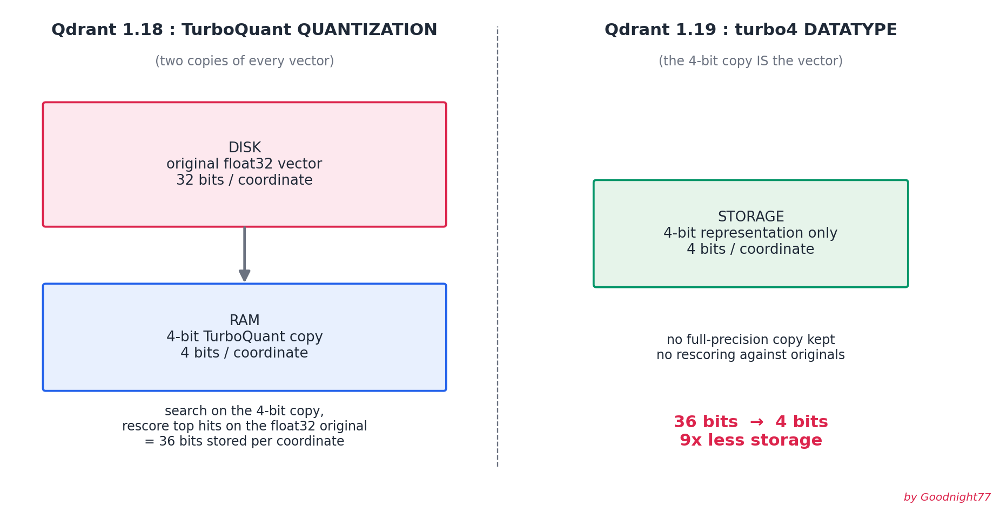

# Qdrant 1.19 Hands-On: Turbo4 Datatype & Memory Tiers

Runnable, minimal demos for every major feature in [Qdrant 1.19](https://qdrant.tech/blog/qdrant-1.19.x/). No API keys, no embedding model downloads, synthetic numpy vectors, everything runs in under a minute.



## Why this exists

Qdrant 1.19 changes how you should think about vector storage:

- **`turbo4` datatype**: store vectors as 4 bits per coordinate ONLY, ~9x less storage than the 1.18 two-copy quantization setup, at the cost of losing full-precision rescoring
- **memory tiers**: one `memory` parameter (`pinned` / `cached` / `cold`) replaces `on_disk`, `always_ram`, and `on_disk_payload`
- **prefix matching**: "starts with" filters on keyword fields (URLs, paths, SKUs) served from a real index
- **slice condition**: deterministic, disjoint partitions of a collection for parallel scrolling and reproducible sampling

Each script demonstrates one feature, prints what it's doing, and verifies the claims (recall measured against exact brute-force search, slice disjointness asserted, tier config read back from the server).

## Quickstart

**1. Start Qdrant 1.19** (needs Docker):

```bash
docker compose up -d
```

or without Docker, download the [v1.19.0 binary](https://github.com/qdrant/qdrant/releases/tag/v1.19.0) and run `./qdrant`.

**2. Install dependencies** (Python 3.10+):

```bash
pip install -r requirements.txt
```

**3. Run the demos** (any order, each is self-contained and re-creates its own collections):

```bash
cd scripts
python 01_turbo4_vs_float32.py      # storage math + recall@10 vs exact search
python 02_memory_tiers.py           # fully-tiered collection, config verified
python 03_prefix_matching.py        # prefix index + MatchPrefix filters
python 04_slice_parallel_scroll.py  # 4 parallel workers, disjointness proven
```

## Expected output (script 01, example run)

```
-> creating 'demo_float32' (datatype=float32) ...
   recall@10 = 0.9980   (50 queries in 0.89s)

-> creating 'demo_turbo4' (datatype=turbo4) ...
   recall@10 = 0.8660   (50 queries in 0.69s)

storage per coordinate:
   float32 storage           : 32 bits
   1.18 TQ quantization      : 32 + 4 = 36 bits (original on disk + 4-bit copy)
   1.19 turbo4 datatype      : 4 bits only  -> 9x smaller than the two-copy model
```

**Important caveat**: the demos use random gaussian vectors, which are the *worst case* for any quantizer. Real embedding models produce structured vectors and the recall gap will be smaller. To benchmark your own data, replace `make_vectors()` in `scripts/common.py` with your embeddings, that's the whole point of it being a separate function.

## When to use what

- **max recall** → `float32`/`float16` storage + TurboQuant *quantization* on top (the 1.18 way, still the right way when accuracy is king)
- **min disk/cost** → `turbo4` datatype (this release)
- **balanced** → `turbo4` + 1-bit TurboQuant quantization: search on the 1-bit index, rescore on the 4-bit vectors

## Requirements

- Qdrant server **>= 1.19.0** (the `turbo4` datatype, `memory` parameter, `MatchPrefix`, and `SliceCondition` don't exist before that)
- `qdrant-client >= 1.19.0`
- upgrading an existing deployment? go one minor version at a time (1.17.x → 1.18.x → 1.19.0), and migrate off the removed `/search`, `/recommend`, `/discover` endpoints first
