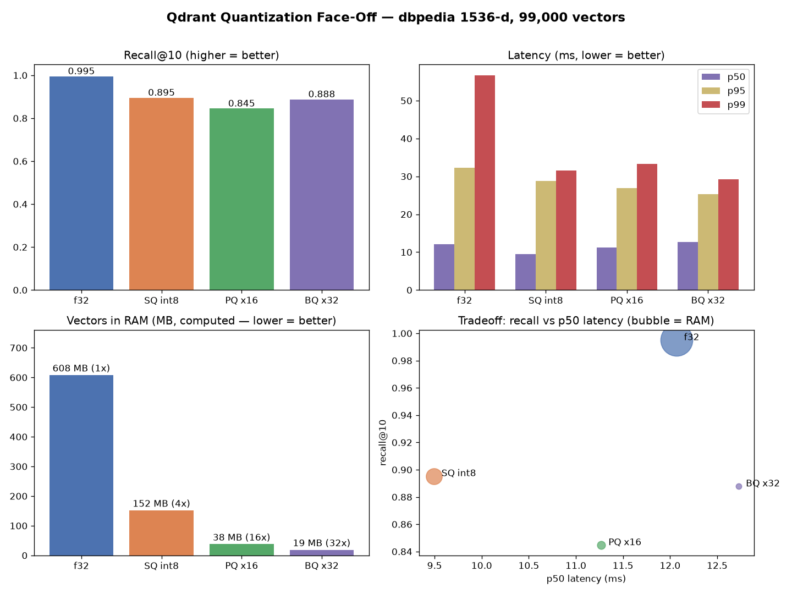
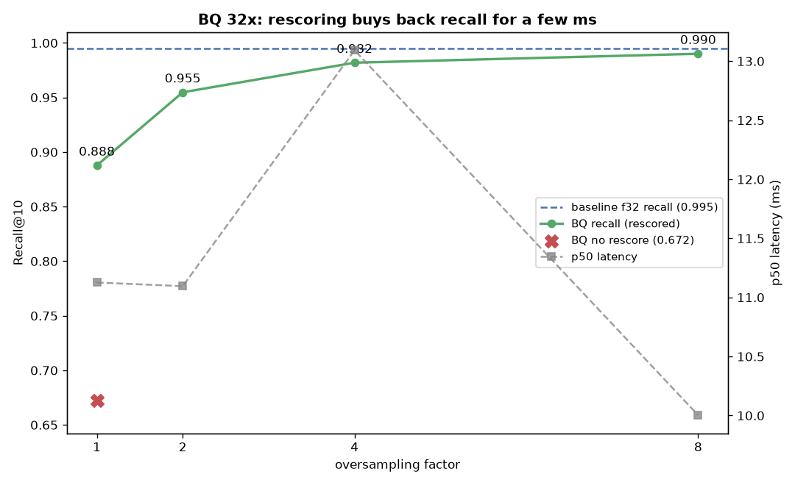

# Qdrant Quantization Face-Off

> **Read the full write-up:** [16× Smaller Vectors in Qdrant: Memory, Recall, and Latency Results](https://medium.com/@mohammedarbinsibi/16-smaller-vectors-in-qdrant-memory-recall-and-latency-results-6081bda5092f)

How much do you actually pay - in recall and latency - to shrink your vectors 4× or 16× in RAM?

This benchmarks four native Qdrant configurations head-to-head on **high-dimensional text embeddings**, measuring the real tradeoff: **recall vs. latency vs. memory** - and how rescoring buys recall back.

- **Baseline** - HNSW, uncompressed `float32`
- **SQ** - Scalar Quantization, `int8` (4× smaller)
- **PQ** - Product Quantization, ×16 compression (16× smaller)
- **BQ** - Binary Quantization, 1 bit/dim (32× smaller)

Dataset: [`dbpedia-entities-openai-1M`](https://huggingface.co/datasets/KShivendu/dbpedia-entities-openai-1M) - OpenAI `ada-002` embeddings, **1536-d, cosine**, real Wikipedia article titles/text as payload. Qdrant runs in local Docker (not Cloud - network jitter would corrupt latency numbers). All runs logged to Weights & Biases.

## Results



99,000 vectors indexed, 1,000 held-out queries, Recall@10 vs. exact-NN ground truth:

| config | Recall@10 | p50 | p95 | p99 | vectors in RAM | compression |
|---|---|---|---|---|---|---|
| **baseline** f32 | **0.995** | 12.1 ms | 32.3 ms | 56.7 ms | 608 MB | 1× |
| **SQ** int8 | 0.895 | **9.5 ms** | 28.7 ms | 31.5 ms | 152 MB | **4×** |
| **PQ** x16 | 0.845 | 11.3 ms | 26.9 ms | 33.3 ms | **38 MB** | **16×** |
| **BQ** x32 | 0.888 | 12.7 ms | 25.3 ms | 29.3 ms | **19 MB** | **32×** |

*Recall is out-of-the-box (default search). Memory = RAM-resident quantized-vector size (computed); SQ/PQ/BQ keep the f32 originals on disk for rescoring. p99 is noisy on a single laptop.*

## Verdict

- **SQ int8 - the easy default.** 4× less RAM, ~0.90 recall out of the box, median latency as fast as baseline.
- **PQ x16 / BQ x32 - when RAM is the wall.** Raw recall drops (0.845 / 0.672), but rescoring buys it straight back.
- **Baseline** is the recall ceiling (0.995) and the memory floor to beat.

### Rescoring is the real lever

Quantized search is fast but approximate. Qdrant can **oversample** candidates on the cheap codes, then **rescore** them against the full-precision originals on disk - one search param. Recall climbs back to baseline:

| config | RAM | raw recall | + rescore (sweet spot) |
|---|---|---|---|
| PQ x16 | 38 MB | 0.845 | **0.989** @ 2× oversampling |
| BQ x32 | 19 MB | 0.672 | **0.990** @ 8× oversampling |

**The takeaway: BQ + 8× rescore = baseline-grade recall (0.990) at 32× less RAM.** You don't choose between small and accurate - you get both. (Binary is lossier than PQ, so it needs a wider oversampling net - but it gets there.)



## Throughput

QPS under 16 concurrent clients, 2,000 queries each (single laptop - CPU-bound, so the spread is modest; real multi-core hardware widens it):

| config | QPS | mean latency under load |
|---|---|---|
| baseline f32 | 156 | 102 ms |
| SQ int8 | 159 | 100 ms |
| PQ x16 | 140 | 114 ms |
| **BQ x32** | **163** | **98 ms** |

Smaller vectors (BQ/SQ) scan faster; PQ pays a codebook-distance overhead.

## What it saves (RAM → $)

RAM is the cost driver of a vector database. Scaling the resident quantized-vector footprint to **10M vectors at 1536-d**, at an illustrative **$5 / GB-month** of RAM:

| config | RAM @ 10M | est. $/month | vs baseline |
|---|---|---|---|
| baseline f32 | 61.4 GB | ~$307 | - |
| SQ int8 | 15.4 GB | ~$77 | 4× cheaper |
| PQ x16 | 3.8 GB | ~$19 | 16× cheaper |
| **BQ x32** | **1.9 GB** | **~$10** | **32× cheaper** |

The f32 originals stay on disk (cheap) and are only touched to rescore. So you size your **RAM** instance to the quantized footprint: **BQ + 8× rescore = ~$10/mo for baseline-grade recall on 10M vectors, vs ~$307/mo uncompressed.** (Numbers illustrative; plug your own $/GB.)

## Quickstart

Requires Docker + [uv](https://docs.astral.sh/uv/). Copy `.env.example` to `.env` and add your `WANDB_API_KEY` (optional `HF_TOKEN`).

```bash
docker compose up -d            # local Qdrant v1.18.2, storage persisted to ./data
uv sync                         # install deps + the qfo package (editable)
uv run python -m qfo.run_all    # the whole faceoff in one command
uv run python -m qfo.demo einstein   # then try search-by-example
```

`run_all` runs these in order (or run any individually with `uv run python -m <module> [args]`):

| step | does |
|---|---|
| `qfo.data.dbpedia` | download + cache dataset (curl, resumable) |
| `qfo.pipeline.ingest` | build baseline / sq / pq collections (+ payload) |
| `qfo.pipeline.add_bq` | add the bq (binary) collection |
| `qfo.data.ground_truth` | exact-NN ground truth for the query set |
| `qfo.bench.eval` | recall + latency -> `results/` + W&B |
| `qfo.bench.rescore_sweep pq` / `bq` | oversampling/rescore sweeps |
| `qfo.bench.throughput` | QPS under concurrency |
| `qfo.viz.report` | dashboard chart -> `assets/` |
| `qfo.viz.rescore_chart pq` / `bq` | sweep charts |

Run everything from the project root: the `qfo` package is importable (installed via `uv sync`), and scripts read/write `data/`, `results/`, `assets/` relative to root.

Collections persist across reboots (bind-mounted volume) - re-run `docker compose up -d` and the data is still there, no re-ingest.

## Layout

Code is the `qfo` package; run modules with `python -m qfo.<...>` from the project root. Data, config, and outputs stay in root (`docker-compose.yml`, `data/`, `results/`, `assets/`).

```
qfo/
  run_all.py                 run the entire pipeline in one command
  config.py                  dataset + collection configs (scale/quant knobs)
  telemetry.py               RAM/latency helpers + W&B wiring (run groups)
  data/
    dbpedia.py               loader: curl shard download, cache, query holdout
    ground_truth.py          exact-NN ground truth via brute-force search
  pipeline/
    ingest.py                create baseline/sq/pq, upload vectors + payload
    add_bq.py                add one collection (e.g. bq) without touching others
  bench/
    eval.py                  Recall@K + latency percentiles -> results/ + W&B
    rescore_sweep.py         oversampling/rescore sweep (pq / bq)
    throughput.py            QPS per config under concurrency
  viz/
    report.py                the faceoff dashboard chart
    rescore_chart.py         rescore-sweep chart
  demo.py                    search-by-example (find similar articles)
```

## Notes

- **Scale knob:** `DATASET_N` in `config.py` (default 100k). 1M needs ~25 GB disk (3 collections keep f32 originals) - use a sequential per-collection ingest if disk-bound.
- **Per-config RAM:** the table uses computed sizes. For *measured* numbers, Qdrant's dashboard (`localhost:6333/dashboard`) shows a per-collection Memory Usage breakdown (vectors / quantized / payload) live - no extra tooling needed.
