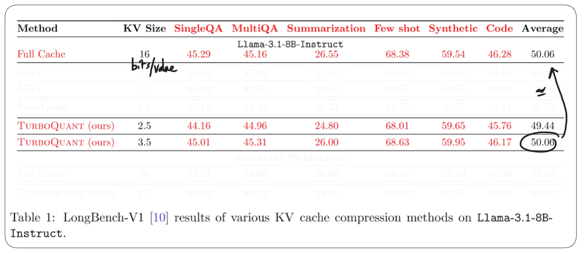
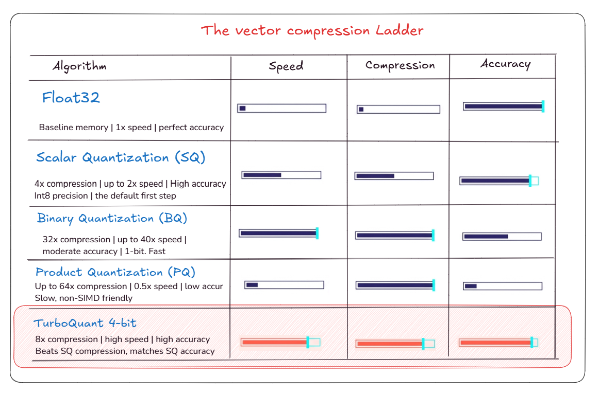

# TurboQuant & Qdrant

**[Read the full blog post here](https://mohamedarbi.xyz/posts/turboquant-qdrant)**

TurboQuant is a vector quantization approach for reducing vector memory usage while keeping search quality high. It is designed for large embedding collections where storing full-precision vectors in RAM becomes expensive.

At a high level, TurboQuant works by rotating vectors, quantizing them with a fixed codebook, and correcting the remaining inner-product bias. This gives strong compression with much lower recall loss than many traditional quantization methods.

For Qdrant users, the main idea is to keep compact quantized vectors in RAM for fast search while storing the original full-precision vectors on disk. This can significantly reduce memory usage without requiring a major application redesign.

## Notebook

- [TurboQuant Qdrant notebook](TurboQuant-Qdrant.ipynb)

## Results

## Comparison

## References

- [Full blog post](https://mohamedarbi.xyz/posts/turboquant-qdrant)
- [Qdrant TurboQuant article](https://qdrant.tech/articles/turboquant-quantization/)
- [TurboQuant paper](https://arxiv.org/abs/2504.19874)
- [Qdrant quantization documentation](https://qdrant.tech/documentation/concepts/quantization/)
