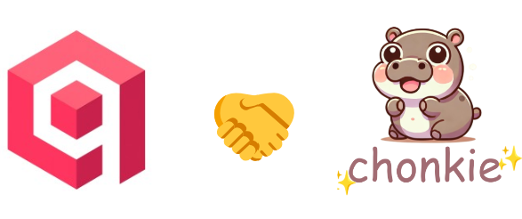

# Chonkie and Qdrant Integration

<!--  -->


## What is Chonkie?
**Chonkie** is a Python SDK that provides a pipeline for chunking text, embedding those chunks, and seamlessly integrating with vector stores like Qdrant.


Chonkie offers multiple chunking strategies for text processing:

- **TokenChunker**: Fixed-size token-based splitting
- **SentenceChunker**: Sentence boundary-aware chunking  
- **RecursiveChunker**: Hierarchical text splitting
- **SemanticChunker**: Embedding-based semantic segmentation
> and many others but we are just trying those 
## Key Features

✨ **Multiple Chunking Strategies** - Choose the best approach for your data  
🔗 **Built-in Qdrant Handshake** - Seamless vector store integration  
⚡ **Performance Optimized** - Fast processing of large text datasets  
📊 **Quality Analysis** - Compare chunking strategies with detailed metrics  

## Quick Start

```bash
pip install chonkie[qdrant]
```

## Contents

- **`Chonkie_Qdrant_Handshake.ipynb`** - Complete integration tutorial showing:
  - Chunking strategy performance comparison
  - Qdrant vector store integration
  - Real-world text processing examples

- **Similar tutorial from the Chonkie cookbook** - [Chonkie_Qdrant_Handshake_for_TinyStories.ipynb](https://github.com/chonkie-inc/cookbook/blob/main/tutorials/Chonkie_Qdrant_Handshake_for_TinyStories.ipynb) that I made
  
- **`tinystories.txt`** - Sample dataset containing 27k+ Tiny Stories for testing chunking strategies (also available for download within the notebook)

## Tutorial Highlights

The notebook demonstrates how Chonkie's built-in Qdrant connector enables you to:
- Process 1,000+ stories efficiently
- Compare different chunking approaches
- Store embeddings directly in Qdrant
- Achieve seamless text-to-vector pipeline integration

Perfect for building RAG systems, semantic search, and document processing applications! 

### References 
* [Chonkie Qdrant Handshake](https://docs.chonkie.ai/python-sdk/handshakes/qdrant-handshake)
* [Chonkie Documentation](https://docs.chonkie.ai/python-sdk/getting-started/introduction)
* [Qdrant Documentation](https://qdrant.tech/documentation/)
* [Other Chonkie Handshakes](https://docs.chonkie.ai/python-sdk/handshakes/overview)

---

**Author**: [Mohamed Arbi Nsibi](https://www.linkedin.com/in/mohammed-arbi-nsibi-584a43241/) 

